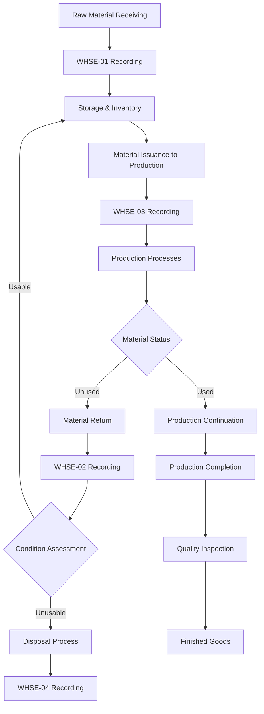

# IIDA Farms Production Documentation & Forms Repository

## 📋 Project Overview

This repository contains the complete documentation system for IIDA Farms' turmeric/ginger powder production tracking. The system provides end-to-end traceability from raw material to finished goods, including material lifecycle management, production process tracking, and quality control documentation.

---

## 🗂️ Repository Structure

```
IIDA-Production-Tracking/
├── README.md                              # This file
└── docs/
    ├── Standard Operating Procedures.md   # Complete production SOP V1.0
    └── Technical Specification.md         # System requirements V1.0
```

---

## 🎯 Purpose

This repository serves as the single source of truth for:

1. **Production Procedures**: Standardized workflows for all roles (warehouse, production, quality control, supervisors)
2. **Material Lifecycle Tracking**: Complete tracking from receiving through disposal
3. **Lot Traceability**: Consistent lot numbering and chain-of-custody documentation
4. **Quality Assurance**: Inspection standards and compliance requirements
5. **Technical Implementation**: Database schema and system requirements

---

## 👥 Target Audience

| Role | Primary Documents | Key Responsibilities |
|------|-------------------|----------------------|
| **Warehouse Staff** | SOP Sections 5.1, Technical Spec Sections 4.1-4.4 | Raw material receiving, issuance, returns, disposal |
| **Production Operators** | SOP Sections 5.2, Technical Spec Sections 4.6 | Process execution, Production Ledgers completion |
| **Quality Control** | SOP Section 6, Technical Spec Section 4.6.10 | Quality inspection, defect tracking |
| **Supervisors** | SOP Sections 5.3, 7, Technical Spec Sections 5-6 | Production planning, KPI monitoring, traceability |
| **Systems Team** | Technical Specification | System implementation and maintenance |
| **Auditors** | SOP Sections 8, 10, Technical Spec Sections 7-9 | Compliance verification, traceability audits |

---

## 📄 Document Descriptions

### 1. **Standard Operating Procedures (V1.0)**

**Purpose:** Complete operational guidelines for all production activities

**Contents:**
- Complete material lifecycle workflow (receiving → production → disposal)
- Lot numbering system with date codes
- Step-by-step procedures for all roles
- Quality control standards and inspection procedures
- Key Performance Indicator calculations
- Documentation and record keeping requirements
- Training and audit procedures
- Troubleshooting and escalation guides

**Key Features:**
- Visual workflow diagrams
- Role-based procedure tables
- Real-time documentation requirements
- Cross-document validation rules
- Complete traceability chain documentation

### 2. **Technical Specification (V1.0)**

**Purpose:** Technical requirements for digital system implementation

**Contents:**
- Field-level specifications for all documents (WHSE-01 to WHSE-04, DT-01, Production Ledgers)
- Data validation rules and business logic
- Cross-document reference requirements
- KPI calculation formulas with source mappings
- System integration and reporting requirements
- Security, access control, and audit trail specifications
- Data retention and archival requirements

**Key Features:**
- Complete field mapping matrix
- Data type and validation specifications
- Business rule definitions
- Implementation phase requirements
- Compliance and audit requirements

---

## 🔄 Complete Production Workflow

### Material Lifecycle Management



### Production Process Flow

1. **Planning** → 2. **Ingredient Preparation** → 3. **Washing** → 4. **Juicing** → 5. **Cooking** → 6. **Drying** → 7. **Pulverizing** → 8. **Sieving** → 9. **Packaging** → 10. **Inspection**

---

## 📊 Key Performance Indicators

| KPI | Formula | Target | Data Source |
|-----|---------|--------|-------------|
| Quality Performance | (Defective ÷ Inspected) × 100 | ≤3% | 10_Inspection sheet |
| Production Yield | (Actual ÷ Target) × 100 | ≥95% | 01_Planning sheet |
| Raw Material Utilization | (Issued ÷ Received) × 100 | ≥90% | WHSE-01, WHSE-03 |
| Return Rate | (Returned ÷ Issued) × 100 | ≤10% | WHSE-02, WHSE-03 |
| Disposal Rate | (Disposed ÷ Received) × 100 | ≤5% | WHSE-04, WHSE-01 |
| Downtime Percentage | (Downtime ÷ Production) × 100 | ≤5% | DT-01, 01_Planning |

---

## 🏗️ System Architecture

### Document Relationships

```
WHSE-01 (Receiving) → WHSE-03 (Issuance) → Production Ledgers
                    ↓
WHSE-02 (Returns) → WHSE-03 (Re-issuance)
                    ↓
WHSE-04 (Disposal)
```

### Cross-Document Validation

- WHSE-02 references WHSE-03
- WHSE-03 references WHSE-01
- WHSE-04 references WHSE-01 (and WHSE-02 if applicable)
- Production Ledgers reference WHSE-03

---

## 📝 Document Completion Standards

### All Documents Must Have:
1. **Complete Information** - All fields filled or marked N/A
2. **Legible Writing** - Clear, readable entries
3. **Accurate Data** - Verified against actual operations
4. **Proper Signatures** - Received By and Endorsed By (different persons)
5. **Timestamps** - Actual times of transactions
6. **Valid Cross-References** - Correct document references

### Timing Requirements:
- Warehouse transactions: Recorded immediately
- Production steps: Recorded as they occur
- Downtime: Recorded immediately when it occurs
- Quality inspection: Recorded upon completion
- All documents: Submitted within 24 hours

---

## 🔒 Quality & Compliance

### Traceability Requirements
For any Production Lot Number, system must provide:
1. Raw material sources (WHSE-01)
2. Material issuance records (WHSE-03)
3. Production process records (Production Ledgers)
4. Quality inspection results (10_Inspection)
5. Any returns (WHSE-02) or disposals (WHSE-04)
6. Any downtime (DT-01)

### Audit Preparedness
- Monthly mock audit exercises
- 15-minute document retrieval target
- Complete traceability verification
- Gap identification and correction

---

## 🛠️ Maintenance & Updates

### Version Control
- Document version numbers in file headers
- Major changes require production manager approval
- Update training materials when procedures change

### Update Process
1. Identify need for change
2. Update relevant documents
3. Review with stakeholders
4. Update version numbers
5. Train affected staff
6. Archive previous versions

---

## 📞 Contact & Support

| Role | Contact | Responsibility |
|------|---------|----------------|
| Systems Designer | John Rey Faciolan | Documentation, SOP updates |

---

## ⚠️ Important Notes

1. **Fresh vs. Returned Materials**: "Fresh" means raw material from warehouse receipt; "Returned" means material previously issued to production
2. **FIFO Implementation**: Returned materials have priority reissue over fresh materials
3. **Real-time Documentation**: All transactions must be recorded as they occur
4. **Cross-Validation**: All document references must be validated
5. **Signature Requirements**: Received By and Endorsed By must be different persons
6. **Retention Period**: Paper documents - 2 years minimum; Digital records - 7 years minimum

---

## 🔗 Document Relationships

```
Standard Operating Procedures
    ↓
Provides operational guidelines for
    ↓
Technical Specification
    ↑
Defines implementation requirements for
    ↓
Production Tracking System
```

---

## 📝 Changelog

| Date | Version | Changes | Author |
|------|---------|---------|--------|
| 2024-06-15 | 1.0 | Added SOP and Technical Specification | John Rey Faciolan |
