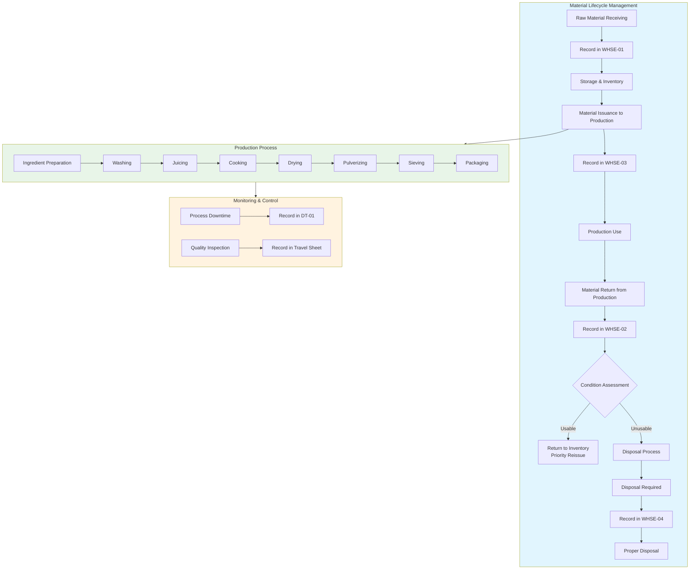
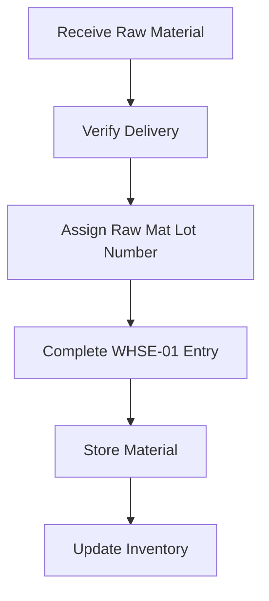
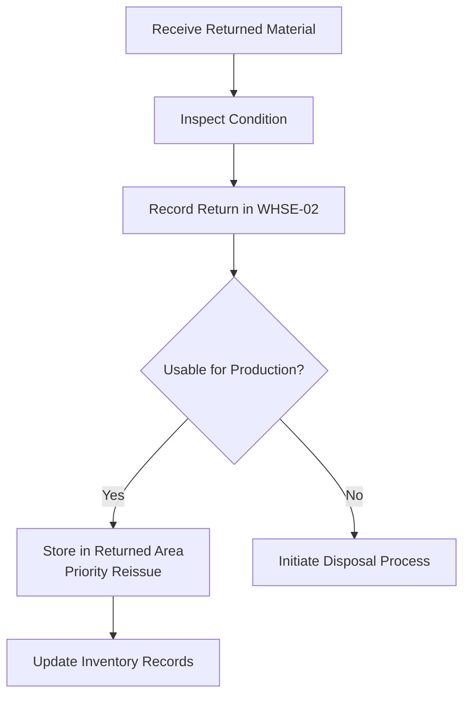
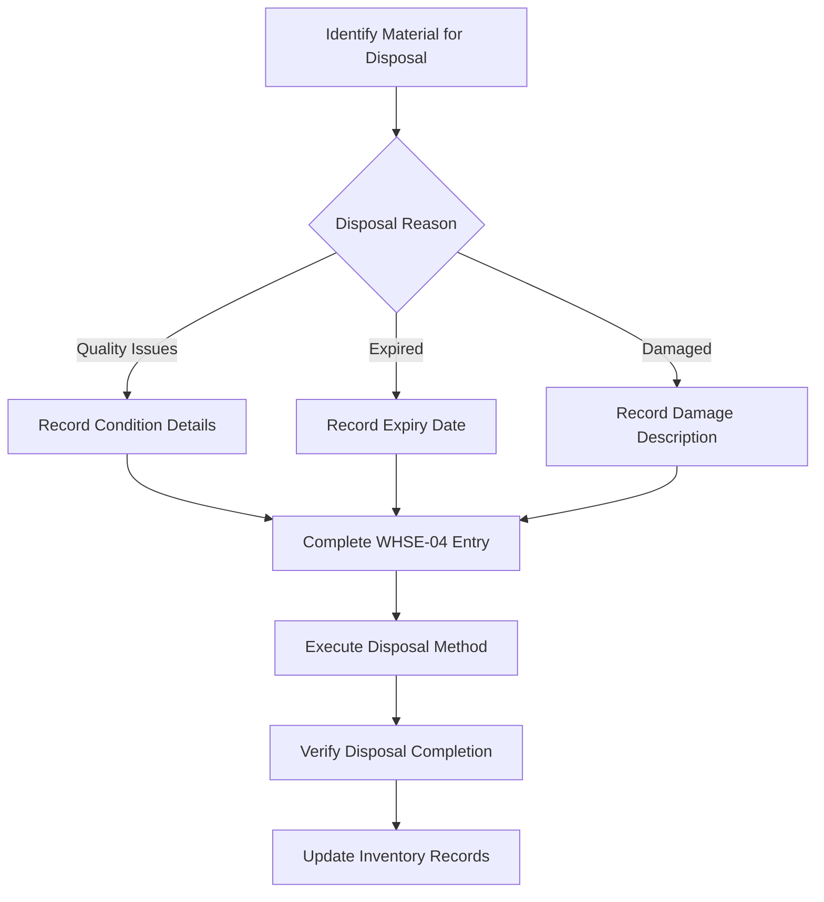
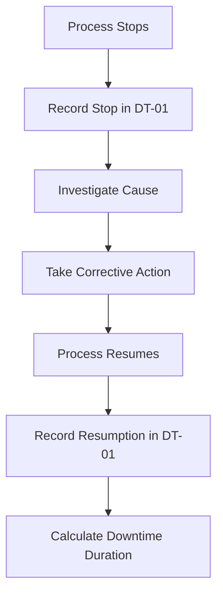
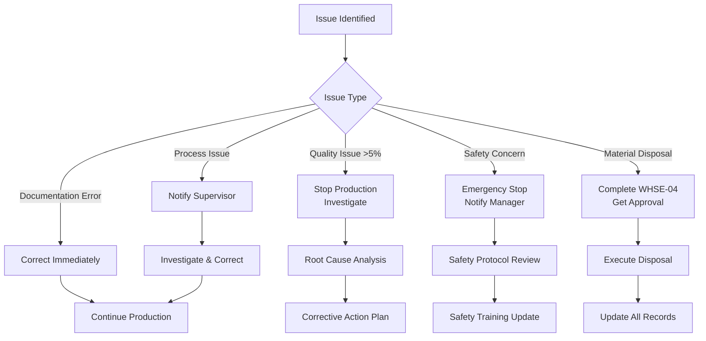

# IIDA FARMS PRODUCTION TRACKING SYSTEM
## STANDARD OPERATING PROCEDURE (VERSION 1.0)

**Document Version:** 1.0  
**Effective Date:** _______________  
**Author:** Production Management Team  
**Approved By:** _______________

---

## 1. PURPOSE

This SOP establishes a complete paper-based tracking system for turmeric/ginger powder production, incorporating:
- End-to-end traceability from raw material to finished goods
- Complete material lifecycle tracking including disposal
- Comprehensive documentation system using Travel Sheets and Ledgers
- Visual workflow guidance through flowcharts
- Key Performance Indicator tracking

---

## 2. SCOPE

Applies to all production activities for turmeric/ginger product families with specific focus on:
- **Material Handling:** Receiving, issuance, returns, and disposal
- **Quality Control:** Inspection and rejection tracking
- **Traceability:** Complete chain from RM-Lot to finished SKU
- **Process Compliance:** All production steps from preparation to packaging

**Documents Covered:**
1. Production Travel Sheet (Single SKU Version)
2. Raw Material Receiving Ledger (WHSE-01)
3. Returned Raw Material Ledger (WHSE-02)
4. Raw Material Issuance Ledger (WHSE-03)
5. Raw Material Disposal Ledger (WHSE-04)
6. Process Downtime Stop/Resume Log (DT-01)

---

## 3. LOT NUMBERING SYSTEM

### 3.1 Date Code Format

**Year End-digit code:**
- 0=J, 1=A, 2=B, 3=C, 4=D, 5=E, 6=F, 7=G, 8=H, 9=I

**Month Code:**
- JAN=1, FEB=2, MAR=3, APR=4, MAY=5, JUN=6, JUL=7, AUG=8, SEP=9, OCT=X, NOV=Y, DEC=Z

**Date Code Format:** `<YEAR_END_CODE><MONTH_CODE><DATE>`
- Example: January 26, 2026 = F126

### 3.2 Lot Creation Guide

| Lot Type | Format | Example |
|----------|--------|---------|
| Production Lot | `P<PRODUCT_CODE><DATE_CODE>` | PTLGF126 |
| Raw Material Lot | `R<MATERIAL_CODE><DATE_CODE>` | RTURF126 |
| Ingredient Lot | `I<MATERIAL_CODE><DATE_CODE>` | ITURF126 |

---

## 4. COMPLETE MATERIAL LIFECYCLE WORKFLOW



---

## 5. DETAILED PROCEDURES

### 5.1 WAREHOUSE PROCEDURES

#### 5.1.1 Raw Material Receiving
**Responsible:** Warehouse Receiving Staff  
**Document:** WHSE-01 (RAW MATERIAL RECEIVING LEDGER)



**Steps:**
1. **Receive & Verify**
   - Check delivery against purchase order
   - Verify material type and quantity

2. **Assign Lot Number**
   - Format: `R<MATERIAL_CODE><DATE_CODE>`
   - Example: `RTURF126` for Turmeric received Jan 26, 2026

3. **Record Receipt (WHSE-01)**

| Field | Action |
|-------|--------|
| Seq No. | Sequential number |
| Endorsed Datetime | Current date and time |
| Received By | Your name/ID |
| Endorsed By | Supervisor name/ID |
| Is Farmer | Check if source is farmer |
| Raw Mat Name | Turmeric/Ginger |
| Material Code | Material code (TUR/GIN) |
| Qty | Quantity received |
| Unit | kg/g/lb |
| Raw Mat Lot Number | Assigned lot number |
| Unit Price | Price per unit |
| is Farmer Paid | Check if farmer paid |
| Amount Paid | Amount paid |
| Paid By | Name of payer |

4. **Storage**
   - Label with RM-Lot number
   - Store in designated area
   - Update storage location records

#### 5.1.2 Material Issuance to Production
**Responsible:** Warehouse Issuance Staff  
**Document:** WHSE-03 (RAW MATERIAL ISSUANCE LEDGER)

**Steps:**
1. **Receive Production Request**
   - Verify Travel Sheet Production Lot number
   - Check material type and quantity needed

2. **Prepare Materials**
   - Gather requested materials
   - Verify quantities

3. **Record Issuance (WHSE-03)**

| Field | Action |
|-------|--------|
| Seq No. | Sequential number |
| Endorsed Datetime | Current date and time |
| Received By | Production operator name |
| Endorsed By | Your name/ID |
| Target Station | Production station receiving |
| Raw Mat Name | Material name |
| Material Code | Material code |
| Qty | Quantity issued |
| Unit | kg/g/lb |
| Raw Mat Lot Number | Source lot number |
| Storage Location | From which location |
| is Fresh Raw Mat? | Check if fresh (not returned) |
| Returned Mat Seq | If returned material, reference WHSE-02 |
| Orig Raw Mat Seq | Reference to original WHSE-01 |

#### 5.1.3 Handling Returned Materials
**Responsible:** Warehouse Staff  
**Document:** WHSE-02 (RETURNED RAW MATERIAL LEDGER)



**Steps:**
1. **Receive Return**
   - Verify material matches RM-Lot number
   - Check condition and quantity

2. **Record Return (WHSE-02)**

| Field | Action |
|-------|--------|
| Seq No. | Sequential number |
| Endorsed Datetime | Current date and time |
| Received By | Your name/ID |
| Endorsed By | Supervisor name/ID |
| Source Station | Station returning material |
| Raw Mat Name | Material name |
| Material Code | Material code |
| Qty | Quantity returned |
| Unit | kg/g/lb |
| Raw Mat Lot Number | RM-Lot number |
| Storage Location | Where to store |
| Returned to Prod. | Check if return to production |
| Returned Datetime | When returned |
| Issuance Seq No. | Reference to WHSE-03 issuance |

3. **Storage Decision**
   - **Usable:** Store in "RETURNED - USABLE" area
   - **Unusable:** Initiate disposal process (Section 5.1.4)

#### 5.1.4 Raw Material Disposal
**Responsible:** Warehouse Staff  
**Document:** WHSE-04 (RAW MATERIAL DISPOSAL LEDGER)



**Disposal Triggers:**
1. **Quality Issues:** Material fails quality standards
2. **Expired:** Material past shelf life
3. **Damaged:** Physically damaged beyond use
4. **Contaminated:** Foreign material contamination
5. **Obsolete:** No longer needed for production

**Disposal Methods:**
- **Composting:** Organic materials
- **Landfill:** Non-compostable materials
- **Recycling:** Packaging materials
- **Special Disposal:** Hazardous materials (if applicable)

**Steps:**
1. **Initiate Disposal**
   - Verify material needs disposal
   - Get supervisor approval if required

2. **Record Disposal (WHSE-04)**

| Field | Action |
|-------|--------|
| Seq No. | Sequential number |
| Disposal Datetime | Date and time of disposal |
| Received By | Person handling disposal |
| Endorsed By | Supervisor name/ID |
| Method | Composting/Landfill/Recycling/Special |
| Raw Mat Name | Material name |
| Material Code | Material code |
| Qty | Quantity disposed |
| Unit | kg/g/lb |
| Raw Mat Lot Number | RM-Lot number |
| Storage Location | Where material was stored |
| is Fresh Raw Mat? | Check if material was fresh |
| Returned Mat Seq | If returned material, reference WHSE-02 |
| Orig Raw Mat Seq | Reference to original WHSE-01 |

3. **Execute Disposal**
   - Follow proper disposal method
   - Ensure environmental compliance
   - Document disposal verification

4. **Update Records**
   - Mark material as disposed in all records
   - Update inventory counts
   - File WHSE-04 with related documents

### 5.2 PRODUCTION TRAVEL SHEET COMPLETION

#### 5.2.1 Section 1: Production Planning
**Responsible:** Production Supervisor

**Steps:**
1. **Create Travel Sheet**
   - One Travel Sheet per SKU
   - Generate Production Lot Number: `P<PRODUCT_CODE><DATE_CODE>`

2. **Complete Section 1**

| Field | Action |
|-------|--------|
| Production Lot No. | Generated lot number |
| Target SKU Code | SKU being produced |
| Unit Weight | Weight per unit |
| Unit Price | Price per unit |
| Target Quantity | Planned production quantity |
| Actual Quantity | Leave blank until completion |
| Planned Start Datetime | Planned start time |
| Actual Start Datetime | Actual start time |
| Planned End Datetime | Planned end time |
| Actual End Datetime | Actual end time |

#### 5.2.2 Section 2: Ingredient Preparation
**Responsible:** Ingredient Prep Operator

**Steps:**
1. **Record Preparation Details**
   - Fill Start Date Time and End Date Time
   - Record each material used

2. **Complete Table**

| Column | Action |
|--------|--------|
| Raw Mat Lot | From warehouse (WHSE-03) |
| Ingredient Lot | Create: `I<MATERIAL_CODE><DATE_CODE>` |
| Qty | Quantity prepared |
| Unit | kg/g/lb |
| PIC | Your name/ID |

#### 5.2.3 Section 3: Process Steps
**Responsible:** Process Operators

**Washing & Juicing (Tables):**
- Record Ingredient Lot, Unit, Input Qty, Start Datetime, Output Qty, End Datetime

**Cooking, Drying, Pulverizing, Sieving (Table):**
For each station and batch:
- Record Station, Batch, Unit, Input Qty, Start Datetime, Output Qty, End Datetime, PIC

#### 5.2.4 Section 4: Packaging
**Responsible:** Packaging Operator

**Packaging Table:**
- Record Batch No, Start Datetime, End Datetime, Qty Packed, PIC

**Quality Verification:**
- Inspector: Name of QC inspector
- Inspection Start/End Datetime: When inspection occurred
- Complete inspection table with counts
- Record batch-wise inspection results

### 5.3 PROCESS DOWNTIME LOGGING
**Responsible:** Station Operator/Supervisor  
**Document:** DT-01 (PROCESS DOWNTIME STOP/RESUME LOG)



**Steps:**
1. **When Process Stops**
   - Immediately record in DT-01:
     - Seq No. (sequential)
     - Station (where downtime occurred)
     - PIC (Person In Charge)
     - Stop Datetime (current time)
     - Reason (brief description)
     - Downtime Code (select from list)

2. **Downtime Codes**
   - **PO** - Raw Material Out
   - **MP** - Machine/Equipment Problem
   - **NP** - No Manpower
   - **PI** - Power Interruption
   - **O** - Others

3. **When Process Resumes**
   - Record Resumption Datetime
   - Downtime Duration auto-calculated

4. **Complete DT-01 Entry**

| Field | Action |
|-------|--------|
| Seq No. | Sequential number |
| Station | Washing/Juicing/Cooking/Drying/etc. |
| PIC | Your name/ID |
| Stop Datetime | When production stopped |
| Resumption Datetime | When production resumed |
| Reason | Detailed description |
| Downtime Code | PO/MP/NP/PI/O |
| Downtime Duration | Auto-calculated (Resumption - Stop) |

---

## 6. QUALITY CONTROL PROCEDURES

### 6.1 Inspection Standards

**Travel Sheet Section 4.2 Standards:**

| Inspection Point | Criteria | Acceptance Level |
|------------------|----------|-----------------|
| Package Integrity | No visible leaks or tears | Zero defects |
| Label/SKU Accuracy | Correct label, no smudges | 99% accuracy |
| Weight Compliance | Within ±2% of target weight | 97% compliance |
| Sealing Integrity | Fully sealed, no gaps | Zero defects |
| Other Defects | Other defects not specified | ≤3% rejection |

### 6.2 Rejection Handling

**Procedure:**
1. **Identify Defective Units**
   - Isolate defective units
   - Record count in Travel Sheet

2. **Calculate Rejection Rate**
   ```
   Rejection Rate = (Defective Units ÷ Inspected Units) × 100
   ```

3. **Take Action Based on Rate:**
   - **≤3%:** Accept batch, note for improvement
   - **3-5%:** Review process, adjust if needed
   - **>5%:** Stop production, investigate root cause

### 6.3 Material Quality Assessment

**Condition Assessment Guide:**

**GOOD Material (Accept for Production):**
- Uniform color appropriate for produce
- No visible mold or discoloration
- Firm texture, not mushy
- Characteristic fresh smell
- Free from foreign materials

**NO GOOD Material (Reject from Production):**
- Any mold present
- Significant discoloration
- Soft/mushy texture
- Unpleasant/fermented odor
- Visible foreign contamination

---

## 7. KEY PERFORMANCE INDICATORS

### 7.1 Daily KPI Calculation

| KPI | Formula | Target |
|-----|---------|--------|
| **Quality Performance** | (Total Defective ÷ Total Inspected) × 100 | ≤3% |
| **Financial Losses Due to Quality** | (Defective Units × Unit Price) + (Downtime Hours × Hourly Cost) | Minimize |
| **Production Yield** | (Actual Output ÷ Target) × 100 | ≥95% |
| **Process Efficiency** | (Output ÷ Input) × 100 | Varies by process |
| **Raw Material Utilization** | (Total Consumed ÷ Total Received) × 100 | ≥90% |
| **Disposal Rate** | (Disposed Qty ÷ Total Received) × 100 | ≤5% |
| **Return Rate** | (Returned Qty ÷ Issued Qty) × 100 | ≤10% |
| **Downtime Percentage** | (Downtime Hours ÷ Production Hours) × 100 | ≤5% |

### 7.2 Financial Tracking

| Metric | Calculation Method |
|--------|-------------------|
| **Raw Material Cost** | Σ(WHSE-01.Qty × WHSE-01.Unit Price) |
| **Quality Loss Cost** | (Defective Units × Unit Price) |
| **Disposal Loss Cost** | Σ(WHSE-04.Qty × Unit Price) |
| **Downtime Cost** | Downtime Hours × Hourly Operating Cost |
| **Final Goods Cost** | Raw Material Cost + Labor + Overhead - Losses |

---

## 8. DOCUMENTATION & RECORD KEEPING

### 8.1 Daily Documentation Checklist

**Morning Shift Start:**
- [ ] Check Travel Sheet supply
- [ ] Verify all ledger books available (WHSE-01 to WHSE-04, DT-01)
- [ ] Confirm all forms are properly sequenced
- [ ] Check previous day's document completion

**During Shift:**
- [ ] Complete all Travel Sheet sections as processes occur
- [ ] Record material movements in appropriate WHSE ledgers
- [ ] Log any downtime in DT-01 immediately
- [ ] Conduct quality inspections and record results
- [ ] Initiate disposal process for non-usable materials

**End of Shift:**
- [ ] Complete all Travel Sheet entries
- [ ] Ensure all ledger entries are complete
- [ ] Sign as PIC for completed work
- [ ] Submit completed documents to supervisor
- [ ] Report any issues or discrepancies

### 8.2 Document Archiving

**Procedure:**
1. **Daily:** Supervisor collects all completed documents
2. **Weekly:** Files documents by production week
3. **Monthly:** Transfers to central archive
4. **Retention:** Keep for minimum 2 years

**Filing System:**
- By Production Date
- By Product Type
- By Production Lot Number
- Cross-reference all related documents

---

## 9. TRAINING REQUIREMENTS

### 9.1 Initial Training

**All Staff Must Complete:**
1. **Lot Numbering System** - 1 hour
2. **Travel Sheet Completion** - 2 hours
3. **Ledger Documentation** - 3 hours (WHSE-01 to WHSE-04, DT-01)
4. **Quality Inspection** - 1 hour
5. **Disposal Procedures** - 1 hour
6. **Downtime Logging** - 1 hour

### 9.2 Competency Assessment

**Warehouse Staff Must Demonstrate:**
- Correct WHSE ledger completion (01-04)
- Accurate material handling and storage
- Proper disposal procedures
- Return material processing

**Production Staff Must Demonstrate:**
- Accurate Travel Sheet completion
- Proper process recording
- Quality inspection competence
- Downtime logging accuracy

---

## 10. AUDIT PREPAREDNESS

### 10.1 Complete Traceability Verification

**Required Documentation for Any Production Lot:**
1. **Raw Material Origin:**
   - WHSE-01 receipt record
   - Material lot number trace
   - Supplier information (if applicable)

2. **Material Movement History:**
   - WHSE-03 issuance records
   - WHSE-02 return records (if any)
   - WHSE-04 disposal records (if any)

3. **Production Journey:**
   - Complete Travel Sheet
   - All process step records
   - DT-01 downtime logs (if any)

4. **Quality Evidence:**
   - Inspection results
   - Rejection calculations
   - Corrective actions
   - Disposal justifications

### 10.2 Mock Audit Procedure

**Monthly Exercise:**
1. Select one completed production lot randomly
2. Assemble all documents within 15 minutes:
   - WHSE-01 for raw materials
   - WHSE-03 for issuances
   - WHSE-02 for returns (if applicable)
   - WHSE-04 for disposals (if applicable)
   - Complete Travel Sheet
   - DT-01 logs (if applicable)
3. Verify complete traceability chain exists
4. Identify and correct any documentation gaps
5. Document lessons learned and update procedures

---

## 11. TROUBLESHOOTING GUIDE

### 11.1 Common Issues & Solutions

| Issue | Immediate Action | Preventive Action |
|-------|-----------------|-------------------|
| **Missing Lot Number** | Assign using correct format | Pre-print lot numbers |
| **Incomplete Travel Sheet** | Complete missing sections | Supervisor spot checks |
| **Wrong Material Issued** | Stop process, return to warehouse | Double-check before issuance |
| **Material Requires Disposal** | Initiate WHSE-04 immediately | Regular quality checks |
| **Downtime Not Logged** | Record immediately when noticed | Train on importance |
| **High Rejection Rate** | Stop production, investigate | Regular quality checks |
| **Discrepancy in Records** | Investigate immediately | Daily reconciliation |

### 11.2 Escalation Procedure



---

## APPENDIX A: QUICK REFERENCE GUIDES

### A.1 Complete Lot Numbering Guide

```
Production Lot: P + PRODUCT_CODE + DATE_CODE
Example: PTLGF126

Raw Material Lot: R + MATERIAL_CODE + DATE_CODE
Example: RTURF126

Ingredient Lot: I + MATERIAL_CODE + DATE_CODE
Example: ITURF126

Date Code: YEAR_END_CODE + MONTH_CODE + DATE
Example: F126 (Jan 26, 2026)

Product Codes: TGLM, TJD, TJWC, GTSB, TGLB, TGPP
Material Codes: TUR (Turmeric), GIN (Ginger)
```

### A.2 Downtime Code Reference

| Code | Meaning | Immediate Action | Escalation Required |
|------|---------|-----------------|---------------------|
| **PO** | Raw Material Out | Check inventory, reorder | Notify supervisor |
| **MP** | Machine/Equipment Problem | Stop machine, tag out | Call maintenance |
| **NP** | No Manpower | Notify supervisor | Adjust schedule |
| **PI** | Power Interruption | Safe shutdown | Notify facilities |
| **O** | Others | Document details | Supervisor decision |

### A.3 Complete Document Matrix

| Process | Document | Completed By | Timing | Related Documents |
|---------|----------|--------------|--------|-------------------|
| Raw Material Receipt | WHSE-01 | Warehouse Staff | At receipt | Purchase Order |
| Material Issuance | WHSE-03 | Warehouse Staff | At issuance | Travel Sheet Sec 1 |
| Material Return | WHSE-02 | Warehouse Staff | At return | WHSE-03 reference |
| Material Disposal | WHSE-04 | Warehouse Staff | At disposal | WHSE-01/02 reference |
| Production Planning | Travel Sheet Sec 1 | Supervisor | Before start | Production Plan |
| Ingredient Prep | Travel Sheet Sec 2 | Prep Operator | During prep | WHSE-03 reference |
| Process Steps | Travel Sheet Sec 3 | Process Operator | During process | Previous step output |
| Packaging | Travel Sheet Sec 4.1 | Packaging Operator | During packaging | Process output |
| Quality Inspection | Travel Sheet Sec 4.2 | QC Inspector | After packaging | Batch records |
| Downtime | DT-01 | Station Operator | Immediately | Supervisor notification |

### A.4 Disposal Method Decision Guide

| Material Condition | Recommended Method | Documentation Required | Approval Needed |
|-------------------|-------------------|------------------------|-----------------|
| Organic, compostable | Composting | WHSE-04 + method details | Supervisor |
| Non-compostable solid | Landfill | WHSE-04 + disposal receipt | Supervisor |
| Recyclable material | Recycling | WHSE-04 + recycling log | Supervisor |
| Hazardous material | Special Disposal | WHSE-04 + safety data + permit | Manager |
| Expired but usable | Donation/Alternative use | WHSE-04 + recipient details | Manager |

---

**END OF DOCUMENT**

---

**TRAINING ACKNOWLEDGEMENT**

I have received and understood training on all procedures outlined in this SOP, including lot numbering, document completion, quality control, disposal procedures, and KPI tracking.

Name: _______________  
Signature: _______________  
Date: _______________  
Employee ID: _______________  
Role: _______________  
Department: _______________  
Trainer: _______________  
Training Date: _______________  
Next Review Date: _______________