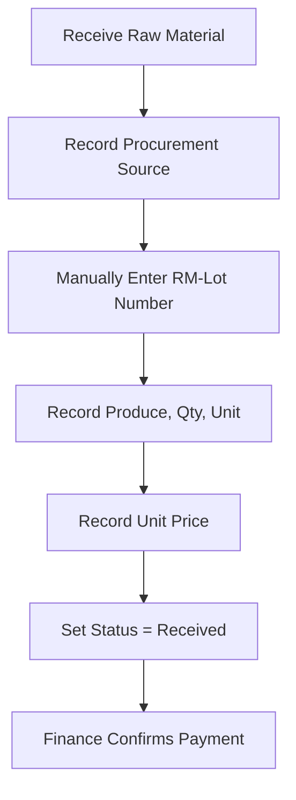
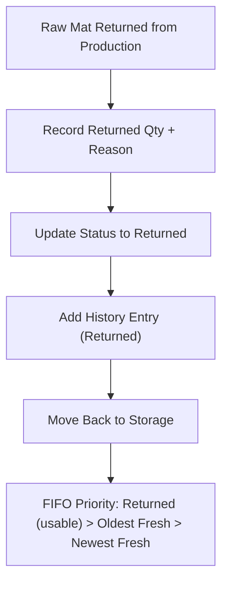
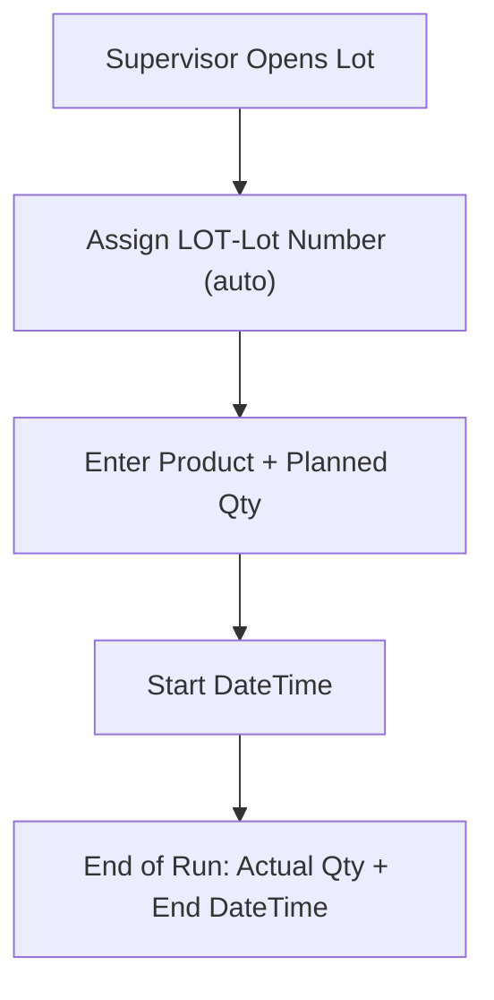
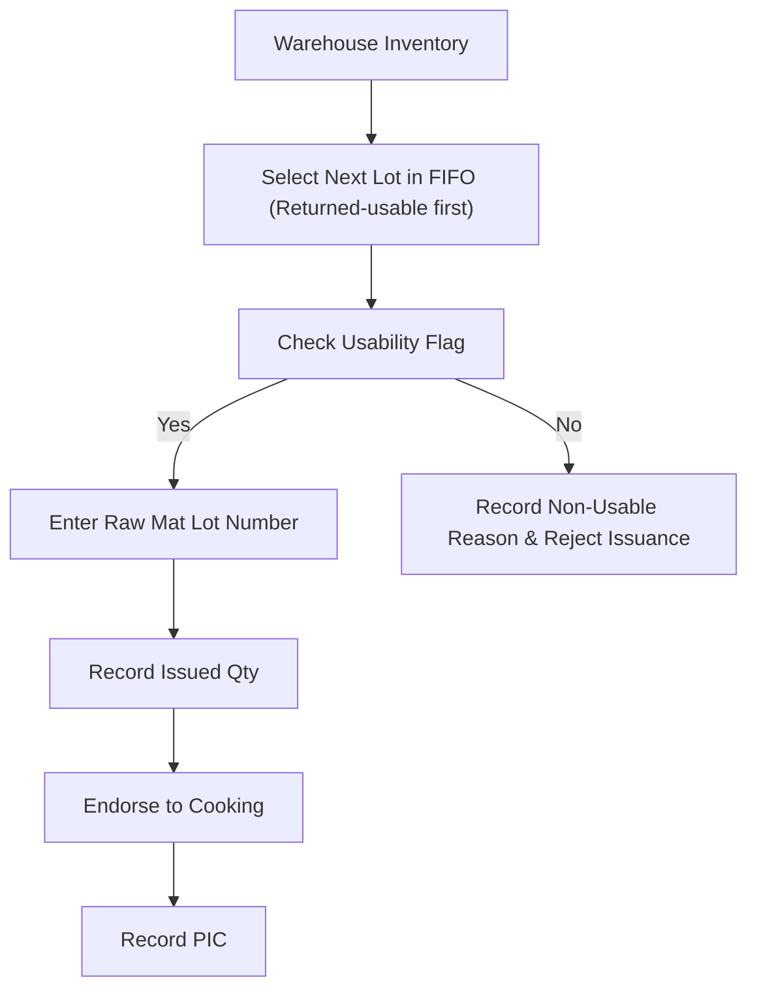
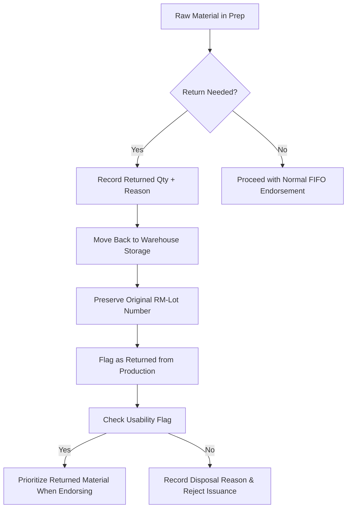
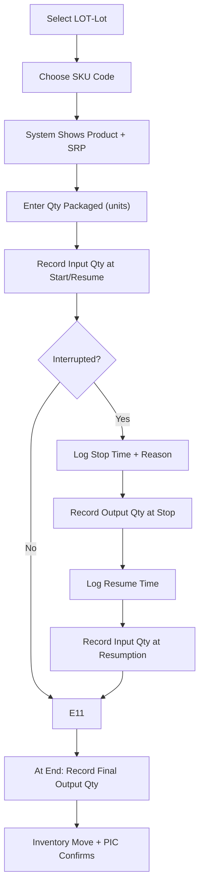

# IIDA Farms – Turmeric/Ginger Powder Production & Data Recording
**Standard Operating Procedure (SOP)**

> **Version:** 1.1
> **Author:** John Rey Faciolan

---

## 1 Purpose

This SOP provides step‑by‑step instructions for all staff involved in the turmeric/ginger powder value chain – warehouse, operators, supervisors and finance – to ensure consistent production, traceability and accurate real‑time data capture. It is designed to work hand‑in‑hand with the **Technical Specification** and the **Lot Creation Guide**, ensuring that every data field recorded matches the normalized database schema and that all lot identifiers follow the agreed naming conventions.

---

## 2 Scope

Applies to every activity that touches raw material, ingredient preparation, processing, packaging and inventory movement for the following product families:

- Turmeric Ginger Lemongrass (powder) – **TGLM**  
- Turmeric Juice Drink – **TJD**  
- Turmeric Juice with Calamansi – **TJWC**  
- Ginger Tea (Salabat) – **GTSB**  
- Turmeric Ginger Lemongrass Brew (tea bags) – **TGLB**  
- Turmeric Ginger Pulp – **TGPP**

All forms, spreadsheets and web‑forms used to capture data must reference the fields listed in the **Technical Specification** and must generate lot numbers that conform to the rules in the **Lot Creation Guide**.

---

## 3 Roles & Responsibilities

| Role | Primary Duties |
|------|----------------|
| **Warehouse Staff** | Receive raw material, *manually write* RM‑Lot numbers, record procurement details, move returned materials back to storage, flag material usability and status. |
| **Finance** | Verify unit prices, confirm farmer payment status, update `RAW_MATERIAL_PRICE`. |
| **Supervisors** | Define production lots (LOT‑Lot), set planned quantities, monitor timelines, sign off records. |
| **Operators** | Execute ingredient preparation, process steps (washing‑juicing‑cooking‑drying‑pulverizing‑sieving), packaging, and inventory moves; record all stoppages/resumptions. |
| **QC Staff** | Validate yields, losses and packaging accuracy; flag discrepancies for audit. |
| **Data Analyst / IT** | Maintain database integrity, enforce lot‑ID uniqueness and format, generate dashboards. |
| **Encoder** | Verify incoming LOT‑Lot IDs, link ingredient lots, correct data inconsistencies before upload. |

---

## 4 Procedure

> All forms used in the field must include the following fields (or their equivalents). The names of the database columns are shown in **bold**; the user‑facing field label is shown in *italics*.

### 4.1 Raw Material Receiving (Warehouse)

| Field | Form Label | DB Column | Notes |
|-------|------------|-----------|-------|
| **raw_mat_lot** | *Raw Material Lot Number* | `RAW_MATERIAL.raw_mat_lot` | **Manually write** following the format: `RM-<PROD‑CODE>-YYYYMMDD-####`. |
| **endorsement_date** | *Endorsement Date* | `RAW_MATERIAL.endorsement_date` | Date when material is received. |
| **procurement_source** | *Procurement Source* | `RAW_MATERIAL.procurement_source` | Enum: `Farmer`, `Market`, `Other`. |
| **farmer_name** | *Farmer Name* | `RAW_MATERIAL.farmer_name` | Required if source = Farmer. |
| **other_source_desc** | *Other Source Description* | `RAW_MATERIAL.other_source_desc` | Required if source = Market/Other. |
| **farmer_paid** | *Farmer Paid* | `RAW_MATERIAL.farmer_paid` | Boolean; updated by Finance. |
| **produce_name** | *Produce Name* | `RAW_MATERIAL.produce_name` | Enum: `Turmeric`, `Ginger`. |
| **qty** | *Quantity* | `RAW_MATERIAL.qty` | Decimal, ≥0. |
| **unit_id** | *Unit* | `RAW_MATERIAL.unit_id` | FK to `UNITS`. |
| **unit_price** | *Unit Price* | `RAW_MATERIAL.unit_price` | Currency. |
| **status** | *Material Status* | `RAW_MATERIAL.status` | Enum: *Received*, *Issued*, *Returned*, *Disposed*. |
| **condition_before_endorsement** | *Condition Before Endorsement* | `RAW_MATERIAL.condition_before_endorsement` | Enum: *GOOD*, *NO GOOD*. |
| **condition_detail** | *Condition Detail* | `RAW_MATERIAL.condition_detail` | Required if condition = NO GOOD. |
| **history** | *Status History* | — (Printed table on form) | Columns: `Date/Time`, `From Status → To Status`, `Person`. |

**Status‑History Instructions (Warehouse Staff)**  
1. When the material is first received, write *Received* in the Status column and add a history entry: “`YYYY‑MM‑DD HH:MM` – Received → Received” (self‑entry).  
2. When the material is issued to Ingredient Prep, change Status to *Issued*, add a history entry with date/time and your name.  
3. If the material is returned from production, change Status to *Returned*, add a history entry.  
4. If the material is disposed (e.g., quality = NO GOOD), change Status to *Disposed*, add a history entry and fill in `condition_detail`.  

**Workflow (Receiving Station)**

---

#### 4.1.1 Handling Returned Raw Materials (Warehouse)

| Field                            | Form Label                     | DB Column                                               |
| -------------------------------- | ------------------------------ | ------------------------------------------------------- |
| **raw_mat_lot**                  | *Raw Material Lot Number*      | `RAW_MATERIAL.raw_mat_lot`                              |
| **returned_qty**                 | *Returned Quantity*            | `RAW_MATERIAL.returned_qty` (new field in RAW_MATERIAL) |
| **return_reason_id**             | *Return Reason*                | `RETURN_REASONS.reason_id`                              |
| **status**                       | *Material Status*              | `RAW_MATERIAL.status` (set to Returned)                 |
| **condition_before_endorsement** | *Condition Before Endorsement* | `RAW_MATERIAL.condition_before_endorsement`             |
| **condition_detail**             | *Condition Detail*             | `RAW_MATERIAL.condition_detail`                         |

**Workflow (Returned Materials)**

---

### 4.2 Production Initiation (Supervisor)

| Field              | Form Label         | DB Column            |
| ------------------ | ------------------ | -------------------- |
| **lot_number**     | *Lot Number*       | `LOT.lot_number`     |
| **product_name**   | *Product Name*     | `LOT.product_name`   |
| **planned_qty**    | *Planned Quantity* | `LOT.planned_qty`    |
| **actual_qty**     | *Actual Quantity*  | `LOT.actual_qty`     |
| **start_datetime** | *Start DateTime*   | `LOT.start_datetime` |
| **end_datetime**   | *End DateTime*     | `LOT.end_datetime`   |
| **supervisor_id**  | *Supervisor ID*    | `EMPLOYEES.emp_id`   |

> **Lot‑ID Generation** – The system automatically creates the lot number using the format: `LOT-<PROD‑CODE>-YYYYMMDD-####`.  
> Example: `LOT-TGLM-20240610-0001` (first Turmeric Ginger Lemongrass lot on 10 Jun 2024).

**Workflow**

---

### 4.3 Ingredient Preparation (Operator)

| Field                    | Form Label                | DB Column                              |
| ------------------------ | ------------------------- | -------------------------------------- |
| **ingredient_lot**       | *Ingredient Lot Number*   | `INGREDIENT_PREP.ingredient_lot`       |
| **raw_mat_lot**          | *Raw Material Lot Number* | `INGREDIENT_PREP.raw_mat_lot`          |
| **lot_number**           | *Parent LOT‑Lot*          | `INGREDIENT_PREP.lot_number`           |
| **qty**                  | *Issued Quantity*         | `INGREDIENT_PREP.qty`                  |
| **unit_id**              | *Unit*                    | `INGREDIENT_PREP.unit_id`              |
| **returned_qty**         | *Returned Quantity*       | `INGREDIENT_PREP.returned_qty`         |
| **return_reason_id**     | *Return Reason*           | `RETURN_REASONS.reason_id`             |
| **endorsement_datetime** | *Endorsement DateTime*    | `INGREDIENT_PREP.endorsement_datetime` |
| **pic_id**               | *PIC*                     | `EMPLOYEES.emp_id`                     |

#### How the Warehouse Staff and Operators Work Together

1. **Warehouse Station** – After a lot is *Issued* (status changed to *Issued*), it sits in the warehouse until an Ingredient Prep request is made.  
2. **Ingredient Prep Station** – The operator pulls the raw material from warehouse storage following FIFO order (Returned materials first, then oldest fresh receipts).  
3. **Endorsement** – The operator records the issuance in the Ingredient Prep form and then hands the material to the Cooking station.  
4. **Cooking Station** – Receives the endorsed ingredient lot and begins the cooking step.

---

#### 4.3.1 Normal Issuance Flow

#### 4.3.2 Return Case Flow

---

### 4.4 Processing Steps (Multi‑Ingredient Handling)

> **Note:** All process steps after cooking operate on a single unified product lot (LOT‑Lot).

#### 4.4.1 Washing & Juicing (Per Ingredient Lot)

| Field               | Form Label              | DB Column                         |
| ------------------- | ----------------------- | --------------------------------- |
| **process_id**      | *Process ID*            | `PROCESS_STEP.process_id`         |
| **lot_number**      | *Unified LOT‑Lot*       | `PROCESS_STEP.lot_number`         |
| **ingredient_lot**  | *Ingredient Lot Number* | `PROCESS_STEP.ingredient_lot`     |
| **input_qty**       | *Input Qty*             | `PROCESS_STEP.input_qty`          |
| **output_qty**      | *Output Qty*            | `PROCESS_STEP.output_qty`         |
| **unit_id**         | *Unit*                  | `PROCESS_STEP.unit_id`            |
| **start_datetime**  | *Start DateTime*        | `PROCESS_STEP.start_datetime`     |
| **stop_datetime**   | *Stop DateTime*         | `STOP_RESUME_LOG.stop_datetime`   |
| **resume_datetime** | *Resume DateTime*       | `STOP_RESUME_LOG.resume_datetime` |
| **stop_reason_id**  | *Stop Reason*           | `STOP_REASONS.reason_id`          |
| **pic_id**          | *PIC*                   | `EMPLOYEES.emp_id`                |

> The same structure applies to **Juicing, Drying, Pulverizing and Sieving**.

#### 4.4.2 Cooking (Combination Step)

| Field               | Form Label                              | DB Column                              |
| ------------------- | --------------------------------------- | -------------------------------------- |
| **process_id**      | *Process ID*                            | `PROCESS_STEP.process_id`              |
| **lot_number**      | *Unified LOT‑Lot*                       | `PROCESS_STEP.lot_number`              |
| **ingredient_lot**  | *Ingredient Lot Number* (multiple rows) | `PROCESS_STEP.ingredient_lot`          |
| **input_qty**       | *Input Qty per Ingredient Lot*          | `PROCESS_STEP.input_qty`               |
| **output_qty**      | *Combined Output Qty*                   | `PROCESS_STEP.output_qty` (single row) |
| **unit_id**         | *Unit*                                  | `PROCESS_STEP.unit_id`                 |
| **start_datetime**  | *Start DateTime*                        | `PROCESS_STEP.start_datetime`          |
| **stop_datetime**   | *Stop DateTime*                         | `STOP_RESUME_LOG.stop_datetime`        |
| **resume_datetime** | *Resume DateTime*                       | `STOP_RESUME_LOG.resume_datetime`      |
| **stop_reason_id**  | *Stop Reason*                           | `STOP_REASONS.reason_id`               |
| **pic_id**          | *PIC*                                   | `EMPLOYEES.emp_id`                     |

#### 4.4.3 Post‑Cooking (Drying → Sieving)

Same table structure as above; the `ingredient_lot` field is left blank (or set to NULL) because only the unified product lot remains.

---

### 4.5 Packaging & Inventory (Operator)

| Field | Form Label | DB Column |
|-------|------------|-----------|
| **package_id** | *Package ID* | `PACKAGING.package_id` |
| **lot_number** | *Unified LOT‑Lot* | `PACKAGING.lot_number` |
| **sku_id** | *SKU ID* | `PACKAGING.sku_id` (FK to `SKUS`) |
| **sku_code** | *SKU Code* | `PACKAGING.sku_code` (display only) |
| **qty** | *Units Packaged* | `PACKAGING.qty` |
| **input_qty** | *Input Qty (kg/g)* | `PACKAGING.input_qty` |
| **output_qty** | *Output Qty (kg/g)* | `PACKAGING.output_qty` |
| **unit_id** | *Unit* | `PACKAGING.unit_id` |
| **inventory_move** | *Inventory Move* | `PACKAGING.inventory_move` (`To Warehouse`, `To Dispatch`) |
| **start_datetime** | *Start DateTime* | `PACKAGING.start_datetime` |
| **stop_datetime** | *Stop DateTime* | `PACKAGING.stop_datetime` |
| **resume_datetime** | *Resume DateTime* | `PACKAGING.resume_datetime` |
| **stop_reason_id** | *Stop Reason* | `STOP_REASONS.reason_id` |
| **pic_id** | *PIC* | `EMPLOYEES.emp_id` |

**Workflow**

---

### 4.6 Stoppage & Resumption (All Steps)

| Field | Form Label | DB Column |
|-------|------------|-----------|
| **log_id** | *Log ID* | `STOP_RESUME_LOG.log_id` |
| **process_id** | *Process ID* | `STOP_RESUME_LOG.process_id` |
| **stop_datetime** | *Stop DateTime* | `STOP_RESUME_LOG.stop_datetime` |
| **resume_datetime** | *Resume DateTime* | `STOP_RESUME_LOG.resume_datetime` |
| **input_qty** | *Input Qty at Resumption* | `STOP_RESUME_LOG.input_qty` |
| **output_qty** | *Output Qty at Stoppage* | `STOP_RESUME_LOG.output_qty` |
| **stop_reason_id** | *Stop Reason* | `STOP_RESUME_LOG.stop_reason_id` |
| **pic_id** | *PIC* | `EMPLOYEES.emp_id` |
| **notes** | *Notes* | `STOP_RESUME_LOG.notes` |

---

### 4.7 KPI Recording

| KPI | Formula (source fields) | Unit |
|-----|------------------------|------|
| **Yield % per Step** | `(Output Qty ÷ Input Qty) × 100` | % |
| **Loss % per Step** | `((Input – Output) ÷ Input) × 100` | % |
| **Planned vs Actual Timeline** | `Supervisor Planned Duration – (End − Start)` | Hours |
| **Downtime Frequency / Duration** | Count of stop events; Sum of `(Resume – Stop)` | # / Hours |
| **Cost of Inputs** | Σ(`RAW_MATERIAL.Qty × RAW_MATERIAL.Unit_Price`) for all raw materials consumed by the lot | PHP |
| **Cost of Outputs** | Σ(`PACKAGING.Output_Qty × SKUS.SRP`) for the lot | PHP |
| **Raw Material Utilization** | `(Total Issued Qty ÷ Total Received Qty) × 100` (per product code) | % |
| **Quality Rejection Rate** | `(Qty of raw mats with condition = NO GOOD ÷ Total Received Qty) × 100` | % |
| **In‑Production Stock** | Count of raw material lots with status = Issued | Units |
| **Return Rate** | `(Qty Returned ÷ Total Issued Qty) × 100` | % |

---

## 5 Data Recording Rules

1. **Input Qty** – Must be recorded at the start of a step or when it resumes after a stoppage.  
2. **Output Qty** – Must be recorded at each stoppage and upon completion of the step.  
3. **Real‑time Capture** – Use the web‑form or tablet app whenever possible.  
4. **Offline Recording** – If no network, log in the prescribed GSheet or paper logbook; upload to the system within 24 h.  
5. **Units** – Always use standard units defined in the `UNITS` table (g, kg, ml, l).  
6. **SKU Codes** – Operators may only select SKU codes from the `SKUS` table; no free‑text entry.  
7. **Supervisor Sign‑off** – Supervisors must review all entries for a lot and sign off at the end of each shift.  
8. **Status Management** –  
   * On receipt → `status = Received`.  
   * When material is issued to Ingredient Prep → `status = Issued` (add history entry).  
   * When returned from production → `status = Returned` (add history entry).  
   * When disposed (quality = NO GOOD) → `status = Disposed` (add history entry).  
9. **Quality Condition** –  
   * The field `condition_before_endorsement` is mandatory on the raw‑material receiving form.  
   * If `condition_before_endorsement = NO GOOD`, the operator must fill in `condition_detail`.  
   * During Ingredient Prep, the operator must verify `usable_for_production` and `condition_at_endorsement`; if unusable, the lot is rejected and an exception record is created.  

---

## 6 SKU Master List (Reference for Operators)

| SKU Code | Product | Size | SRP |
|---|---|---|---|
| TGLM-PCH-500G | Turmeric Ginger Lemongrass | 500 g | P220 |
| TGLM-PCH-200G | Turmeric Ginger Lemongrass | 200 g | P130 |
| TGLM-SAC-10GX12 | Turmeric Ginger Lemongrass | 10 g×12 sachets | P115 |
| TJD-PCH-500G | Turmeric Juice Drink | 500 g | P220 |
| TJD-PCH-200G | Turmeric Juice Drink | 200 g | P130 |
| TJD-SAC-10GX12 | Turmeric Juice Drink | 10 g×12 sachets | P115 |
| TJWC-PCH-500G | Turmeric Juice with Calamansi | 500 g | P220 |
| TJWC-PCH-200G | Turmeric Juice with Calamansi | 200 g | P130 |
| GTSB-PCH-500G | Ginger Tea (Salabat) | 500 g | P220 |
| GTSB-PCH-200G | Ginger Tea (Salabat) | 200 g | P130 |
| GTSB-SAC-10GX12 | Ginger Tea (Salabat) | 10 g×12 sachets | P115 |
| TGLB-TBG-3.5GX10 | Turmeric Ginger Lemongrass Brew | 3.5 g×10 | P130 |
| TGLB-CIN-TBG-3.5GX10 | Turmeric Ginger Lemongrass Brew w/ Cinnamon | 3.5 g×10 | P150 |
| TGPP-PCH-50G | Turmeric Ginger Pulp | 50 g | P95 |

> The `SKUS` master table contains additional fields such as `product_code`, `pack_type`, `size_desc`, `unit`, `srp`, `standard_cost` and an `active` flag. All forms reference this table for SKU selection.

---

## 7 Compliance & Audit

1. **Traceability** – Every raw material, ingredient lot and product lot is traceable to its source via the normalized schema.  
2. **Data Integrity** – Database constraints enforce uniqueness of lot numbers and foreign‑key relationships.  
3. **Audit Trail** – All changes to critical fields (e.g., `raw_mat_lot`, `lot_number`) are logged with user ID and timestamp.  
4. **Missing / Late Entries** – The analytics engine flags any lot with missing input/output or stoppage logs and raises a dashboard alert.  
5. **Weekly Review** – Supervisors must audit all lots produced in the previous week for completeness and accuracy.  
6. **Continuous Improvement** – Any recurring data quality issues are logged in the “Process Improvement” backlog.

---

## 8 Appendix – Lot Creation & Naming Conventions

| Entity | Format | Example |
|--------|--------|---------|
| **Raw‑Material Lot (RM‑Lot)** | `RM-<PROD-CODE>-YYYYMMDD-####` | `RM‑GIN‑20240610‑0003` |
| **Ingredient‑Prep Lot (ING‑Lot)** | `ING-<RAW-MAT-LOT>-YYYYMMDD-####` | `ING‑RM‑GIN‑20240610‑0003‑001` |
| **Unified Product Lot (LOT‑Lot)** | `LOT-<PROD-CODE>-YYYYMMDD-####` | `LOT‑TGLM‑20240610‑0001` |

> **Rules**  
> 1. All identifiers are uppercase and hyphen‑separated.  
> 2. `<PROD-CODE>` is the product code from the selected SKU (e.g., `TGLM`).  
> 3. `<YYYYMMDD>` is the calendar date of lot creation (raw receipt, prep start or cooking finish).  
> 4. `####` is a zero‑padded 4‑digit sequence that resets to `0001` each day per product code.  

---
