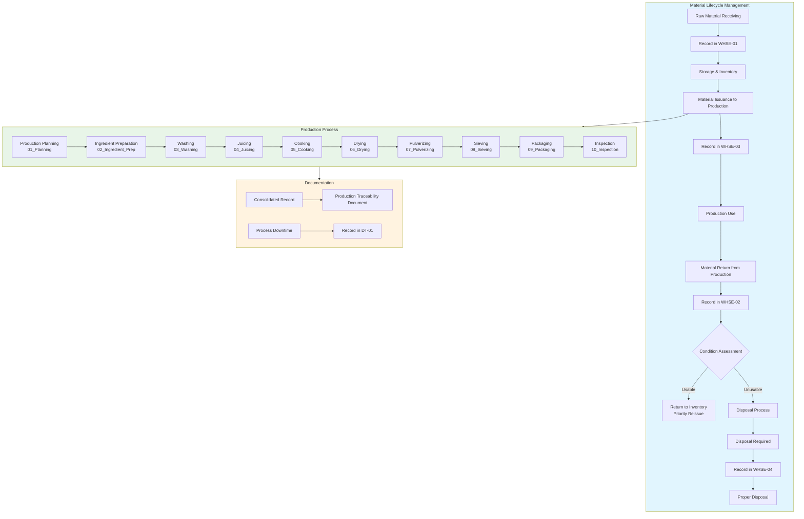
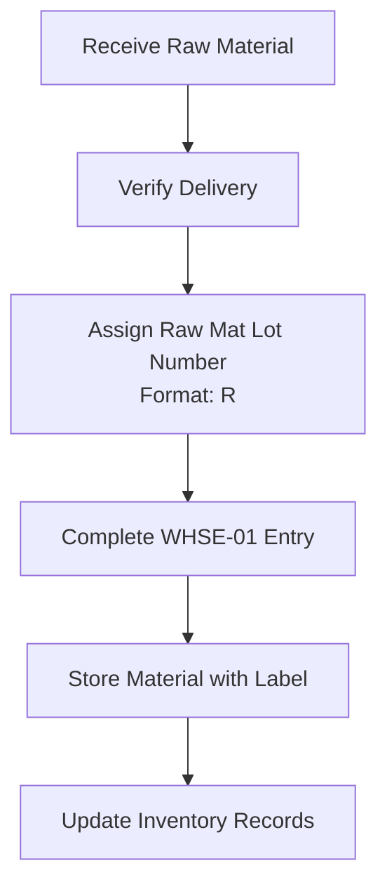
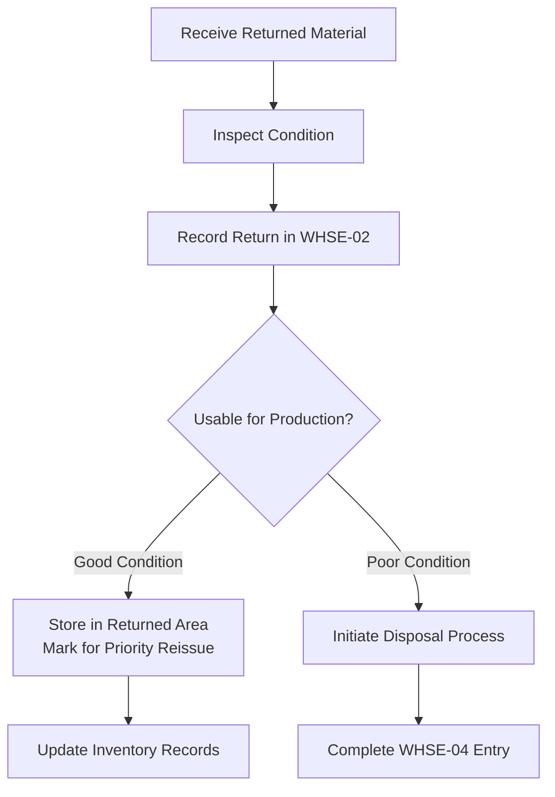
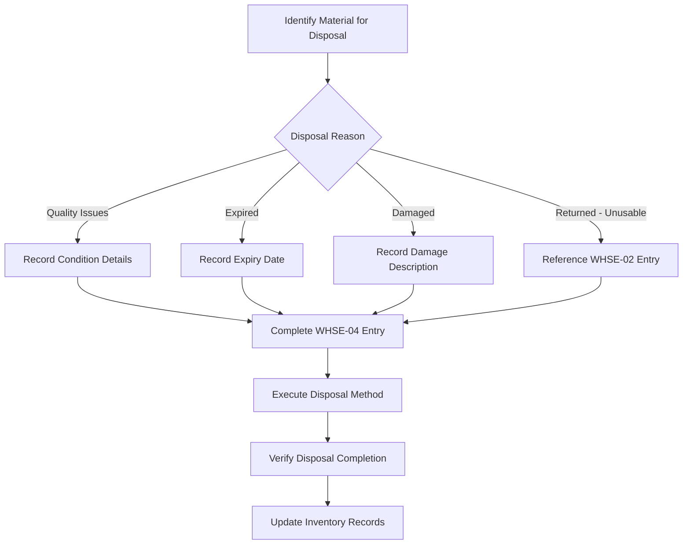
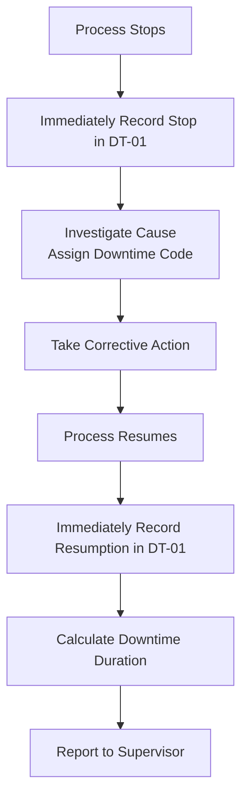
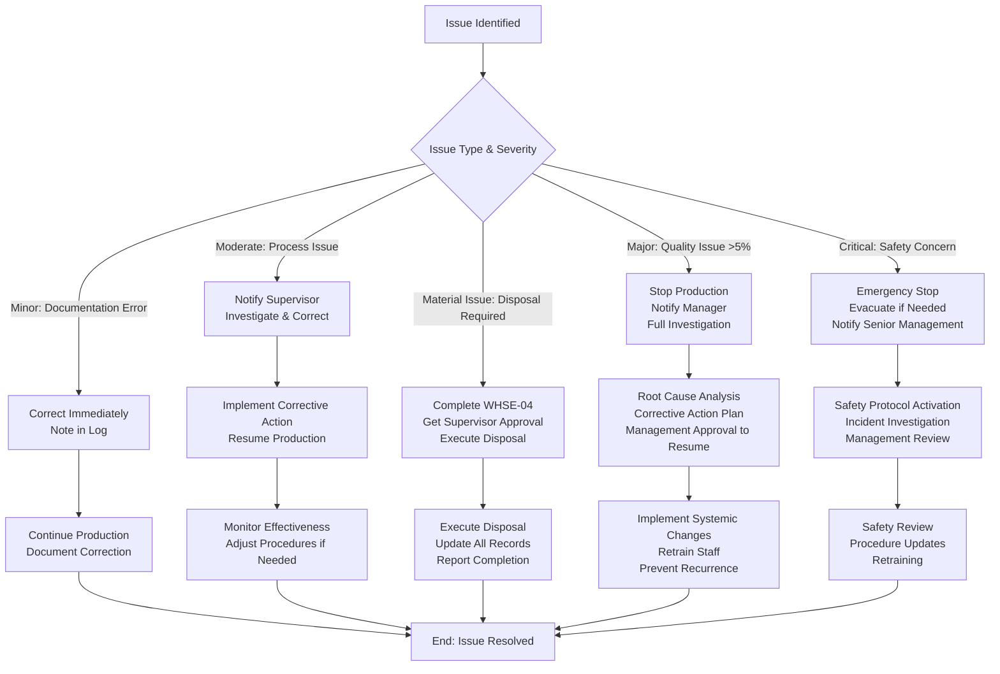

# IIDA FARMS PRODUCTION TRACKING SYSTEM
## STANDARD OPERATING PROCEDURE (VERSION 1.0)

**Document Version:** 1.0  
**Effective Date:** _______________  
**Author:** John Rey Faciolan
**Position: Analytics and Automation Consultant** 
**Approved By:** _______________

---

## 1. PURPOSE

This SOP establishes a complete paper-based tracking system for turmeric/ginger powder production, incorporating:
- End-to-end traceability from raw material to finished goods
- Complete material lifecycle tracking including disposal
- Comprehensive documentation system using Production Ledgers and Warehouse Ledgers
- Visual workflow guidance through flowcharts
- Key Performance Indicator tracking

---

## 2. SCOPE

Applies to all production activities for turmeric/ginger product families with specific focus on:
- **Material Handling:** Receiving, issuance, returns, and disposal
- **Production Processes:** All steps from ingredient preparation through packaging
- **Quality Control:** Inspection and rejection tracking
- **Traceability:** Complete chain from RM-Lot to finished SKU
- **Process Compliance:** All production steps from preparation to packaging

**Documents Covered:**
1. Production Ledgers (Excel Workbook with 10 sheets)
2. Production Traceability Document (Word Document)
3. Raw Material Receiving Ledger (WHSE-01)
4. Returned Raw Material Ledger (WHSE-02)
5. Raw Material Issuance Ledger (WHSE-03)
6. Raw Material Disposal Ledger (WHSE-04)
7. Process Downtime Stop/Resume Log (DT-01)

---

## 3. LOT NUMBERING SYSTEM

### 3.1 Date Code Format

**Year End-digit code:**
- 0=J, 1=A, 2=B, 3=C, 4=D, 5=E, 6=F, 7=G, 8=H, 9=I

**Month Code:**
- JAN=1, FEB=2, MAR=3, APR=4, MAY=5, JUN=6, JUL=7, AUG=8, SEP=9, OCT=X, NOV=Y, DEC=Z

**Date Code Format:** `<YEAR_END_CODE><MONTH_CODE><DATE>`
- Example: January 26, 2026 = F126

### 3.2 Lot Creation Guide

| Lot Type | Format | Example |
|----------|--------|---------|
| Production Lot | `P<PRODUCT_CODE><DATE_CODE>` | PTLGF126 |
| Raw Material Lot | `R<MATERIAL_CODE><DATE_CODE>` | RTURF126 |
| Ingredient Lot | `I<MATERIAL_CODE><DATE_CODE>` | ITURF126 |

**Important Definitions:**
- **Fresh Raw Material:** Raw material coming directly from warehouse receipt, not from returned materials from production
- **Returned Raw Material:** Material previously issued to production but returned unused or partially used
- **Ingredient:** Prepared raw material ready for production processes

---

## 4. COMPLETE MATERIAL LIFECYCLE WORKFLOW



---

## 5. DETAILED PROCEDURES

### 5.1 WAREHOUSE PROCEDURES

#### 5.1.1 Raw Material Receiving
**Responsible:** Warehouse Receiving Staff  
**Document:** WHSE-01 (RAW MATERIAL RECEIVING LEDGER)



**Steps:**
1. **Receive & Verify**
   - Check delivery against purchase order
   - Verify material type and quantity
   - Inspect for quality upon receipt

2. **Assign Lot Number**
   - Format: `R<MATERIAL_CODE><DATE_CODE>`
   - Example: `RTURF126` for Turmeric received Jan 26, 2026
   - Material Codes: TUR (Turmeric), GIN (Ginger)

3. **Record Receipt (WHSE-01)**

| Field | Action | Notes |
|-------|--------|-------|
| Seq No. | Sequential number | Auto-incremented |
| Endorsed Datetime | Current date and time | Use 24-hour format |
| Received By | Your name/ID | Sign or print clearly |
| Endorsed By | Supervisor name/ID | Must be different from Received By |
| Is Farmer | Check if source is farmer | ✓ or ✗ |
| Raw Mat Name | Turmeric or Ginger | Must match material |
| Material Code | TUR or GIN | Must match Raw Mat Name |
| Qty | Quantity received | Record actual weight |
| Unit | kg, g, or lb | Use consistent units |
| Raw Mat Lot Number | Assigned lot number | From Step 2 |
| Unit Price | Price per unit | From purchase order |
| Farmer Paid | Check if farmer paid | Only if Is Farmer = ✓ |
| Amount Paid | Amount paid | Only if Farmer Paid = ✓ |
| Paid By | Name of payer | Only if Amount Paid > 0 |

4. **Storage**
   - Label storage container with RM-Lot number
   - Store in designated area
   - Update storage location records
   - Note: All materials received are considered "FRESH" at this point

#### 5.1.2 Material Issuance to Production
**Responsible:** Warehouse Issuance Staff  
**Document:** WHSE-03 (RAW MATERIAL ISSUANCE LEDGER)

**Steps:**
1. **Receive Production Request**
   - Verify Production Lot number from 01_Planning sheet
   - Check material type and quantity needed
   - Follow FIFO (First-In-First-Out) principle

2. **Prepare Materials**
   - Gather requested materials
   - Verify quantities match request
   - Check material condition before issuance

3. **Record Issuance (WHSE-03)**

| Field | Action | Notes |
|-------|--------|-------|
| Seq No. | Sequential number | Auto-incremented |
| Endorsed Datetime | Current date and time | Use 24-hour format |
| Received By | Production operator name | From Travel Sheet PIC |
| Endorsed By | Your name/ID | Warehouse staff issuing |
| Target Station | Production station receiving | Must match Travel Sheet |
| Raw Mat Name | Material name | Turmeric or Ginger |
| Material Code | Material code | TUR or GIN |
| Qty | Quantity issued | Actual weight issued |
| Unit | kg, g, or lb | Must match WHSE-01 unit |
| Raw Mat Lot Number | Source lot number | From WHSE-01 |
| Storage Location | From which location | Warehouse location code |
| is Fresh Raw Mat? | Check if fresh | ✓ for materials not from returns |
| Returned Mat Seq | If returned material | Reference WHSE-02 Seq No. |
| Orig Raw Mat Seq | Reference to original WHSE-01 | Mandatory field |

**Important Rules:**
- `is Fresh Raw Mat?` = ✓ for materials issued directly from WHSE-01 receipts
- `is Fresh Raw Mat?` = ✗ for materials issued from WHSE-02 returns
- When issuing returned materials, `Returned Mat Seq` must reference valid WHSE-02 entry
- `Orig Raw Mat Seq` must always reference the original WHSE-01 receipt

#### 5.1.3 Handling Returned Materials
**Responsible:** Warehouse Staff  
**Document:** WHSE-02 (RETURNED RAW MATERIAL LEDGER)



**Steps:**
1. **Receive Return**
   - Verify material matches RM-Lot number
   - Check condition and quantity
   - Confirm with production staff reason for return

2. **Record Return (WHSE-02)**

| Field | Action | Notes |
|-------|--------|-------|
| Seq No. | Sequential number | Auto-incremented |
| Endorsed Datetime | Current date and time | Use 24-hour format |
| Received By | Your name/ID | Warehouse staff receiving |
| Endorsed By | Supervisor name/ID | Must be different from Received By |
| Source Station | Station returning material | From Travel Sheet |
| Raw Mat Name | Material name | Turmeric or Ginger |
| Material Code | Material code | TUR or GIN |
| Qty | Quantity returned | Actual weight returned |
| Unit | kg, g, or lb | Must match original unit |
| Raw Mat Lot Number | RM-Lot number | From WHSE-01 |
| Storage Location | Where to store | Returned materials area |
| Returned to Prod. | Check if return to production | ✓ if usable, ✗ if for disposal |
| Returned Datetime | When returned | Actual return time |
| Issuance Seq No. | Reference to WHSE-03 issuance | Mandatory field |

3. **Storage Decision**
   - **Usable (Returned to Prod. = ✓):** Store in "RETURNED - USABLE" area
     - These materials will be issued with `is Fresh Raw Mat?` = ✗ in WHSE-03
     - Priority for reissue before fresh materials (FIFO exception)
   - **Unusable (Returned to Prod. = ✗):** Initiate disposal process

#### 5.1.4 Raw Material Disposal
**Responsible:** Warehouse Staff  
**Document:** WHSE-04 (RAW MATERIAL DISPOSAL LEDGER)



**Disposal Triggers:**
1. **Quality Issues:** Material fails quality standards
2. **Expired:** Material past shelf life
3. **Damaged:** Physically damaged beyond use
4. **Contaminated:** Foreign material contamination
5. **Returned - Unusable:** Materials returned from production in poor condition

**Disposal Methods:**
- **Composting:** Organic materials (preferred method)
- **Landfill:** Non-compostable materials
- **Recycling:** Packaging materials only
- **Special Disposal:** Hazardous materials (if applicable)

**Steps:**
1. **Initiate Disposal**
   - Verify material needs disposal
   - Get supervisor approval
   - Determine appropriate disposal method

2. **Record Disposal (WHSE-04)**

| Field | Action | Notes |
|-------|--------|-------|
| Seq No. | Sequential number | Auto-incremented |
| Disposal Datetime | Date and time of disposal | Actual disposal time |
| Received By | Person handling disposal | Warehouse staff |
| Endorsed By | Supervisor name/ID | Approval required |
| Method | Composting/Landfill/Recycling/Special | Must select one |
| Raw Mat Name | Material name | Turmeric or Ginger |
| Material Code | Material code | TUR or GIN |
| Qty | Quantity disposed | Actual weight disposed |
| Unit | kg, g, or lb | Must match original unit |
| Raw Mat Lot Number | RM-Lot number | From WHSE-01 |
| Storage Location | Where material was stored | Last known location |
| is Fresh Raw Mat? | Check if material was fresh | ✓ if never issued, ✗ if from returns |
| Returned Mat Seq | If returned material | Reference WHSE-02 Seq No. |
| Orig Raw Mat Seq | Reference to original WHSE-01 | Mandatory field |

**Important Rules:**
- `is Fresh Raw Mat?` = ✓ if material disposed was never issued to production
- `is Fresh Raw Mat?` = ✗ if material disposed came from WHSE-02 returns
- When disposing returned materials, `Returned Mat Seq` must reference valid WHSE-02 entry
- `Orig Raw Mat Seq` must always reference the original WHSE-01 receipt

3. **Execute Disposal**
   - Follow proper disposal method procedures
   - Ensure environmental compliance
   - Obtain disposal verification/receipt if required

4. **Update Records**
   - Mark material as disposed in all records
   - Update inventory counts
   - File WHSE-04 with related documents

### 5.2 PRODUCTION LEDGERS COMPLETION

**Document:** Production Ledgers (Excel Workbook)

#### 5.2.1 Sheet 01_Planning: Production Planning
**Responsible:** Production Supervisor

**Steps:**
1. **Create Production Record**
   - Open Production Ledgers Excel workbook
   - Go to 01_Planning sheet
   - Generate Production Lot Number: `P<PRODUCT_CODE><DATE_CODE>`

2. **Complete Planning Section**

| Field | Action | Notes |
|-------|--------|-------|
| Production Lot No. | Generated lot number | Format: PTLGF126 |
| Target SKU | SKU being produced | From product list |
| Unit Weight | Weight per unit | In grams or kilograms |
| Unit Price | Price per unit | From pricing sheet |
| Target Quantity | Planned production quantity | Total units planned |
| Planned Start Date | Planned start date | DD/MM/YYYY format |
| Planned Start Time | Planned start time | 24-hour format |
| Planned End Date | Planned end date | DD/MM/YYYY format |
| Planned End Time | Planned end time | 24-hour format |
| Actual Quantity | Leave blank | Fill after production |
| Actual Start Datetime | Leave blank | Fill when production starts |
| Actual End Datetime | Leave blank | Fill when production ends |

#### 5.2.2 Sheet 02_Ingredient_Prep: Ingredient Preparation
**Responsible:** Ingredient Prep Operator

**Steps:**
1. **Record Preparation Details**
   - Fill Start Date and Start Time when preparation begins
   - Fill End Date and End Time when preparation completes

2. **Complete Ingredient Table**

| Column | Action | Notes |
|--------|--------|-------|
| Production Lot No. | From 01_Planning | Must match exactly |
| Start Date | Preparation start date | DD/MM/YYYY |
| Start Time | Preparation start time | 24-hour format |
| End Date | Preparation end date | DD/MM/YYYY |
| End Time | Preparation end time | 24-hour format |
| Raw Mat Lot | From warehouse (WHSE-03) | Must exist in WHSE-03 |
| Ingredient Lot | Create: `I<MATERIAL_CODE><DATE_CODE>` | Example: ITURF126 |
| Qty | Quantity prepared | Actual weight prepared |
| Unit | kg, g, or lb | Must match WHSE-03 unit |
| PIC | Your name/ID | Sign or print clearly |

**Important Rules:**
- Each Raw Mat Lot from WHSE-03 gets its own Ingredient Lot
- Ingredient Lot follows same date code as production date
- Record all materials pulled from warehouse for this production

#### 5.2.3 Sheets 03_Washing to 08_Sieving: Process Steps
**Responsible:** Process Operators for each station

**General Procedure for All Process Sheets:**
1. **Record Process Start**
   - Fill Start Date and Start Time when process begins
   - Record Input Qty (from previous process or ingredient preparation)

2. **Record Process Completion**
   - Fill End Date and End Time when process completes
   - Record Output Qty (actual output weight)
   - Calculate and note any weight loss/gain

**Sheet-Specific Requirements:**

**03_Washing & 04_Juicing Sheets:**
- Ingredient Lot must exist in 02_Ingredient_Prep sheet
- Track each Ingredient Lot separately through washing and juicing

**05_Cooking to 08_Sieving Sheets:**
- Record Total Input Qty (sum of inputs to this process)
- Record Total Output Qty (actual output from this process)
- Unit must be consistent through all processes
- PIC must be recorded for accountability

#### 5.2.4 Sheet 09_Packaging: Packaging
**Responsible:** Packaging Operator

**Steps:**
1. **Record Packaging Details**
   - Fill Start Date and Start Time when packaging begins
   - Fill End Date and End Time when packaging completes

2. **Complete Packaging Table**

| Column | Action | Notes |
|--------|--------|-------|
| Production Lot No. | From 01_Planning | Must match exactly |
| Start Date | Packaging start date | DD/MM/YYYY |
| Start Time | Packaging start time | 24-hour format |
| End Date | Packaging end date | DD/MM/YYYY |
| End Time | Packaging end time | 24-hour format |
| Qty Packed | Quantity packaged | Actual units packaged |
| PIC | Your name/ID | Sign or print clearly |

#### 5.2.5 Sheet 10_Inspection: Quality Inspection
**Responsible:** Quality Control Inspector

**Steps:**
1. **Record Inspection Details**
   - Fill Start Date and Start Time when inspection begins
   - Fill End Date and End Time when inspection completes

2. **Complete Inspection Table**

| Column | Action | Notes |
|--------|--------|-------|
| Production Lot No. | From 01_Planning | Must match exactly |
| Start Date | Inspection start date | DD/MM/YYYY |
| Start Time | Inspection start time | 24-hour format |
| End Date | Inspection end date | DD/MM/YYYY |
| End Time | Inspection end time | 24-hour format |
| Qty Inspected | Quantity inspected | Sample or 100% inspection |
| Qty Defective | Quantity found defective | Record all defects |
| PIC | Your name/ID | Sign or print clearly |

### 5.3 PRODUCTION TRACEABILITY DOCUMENT COMPLETION
**Responsible:** Production Supervisor

**Purpose:** Consolidated record of entire production lot

**Steps:**
1. **Complete Section 1: Production Planning**
   - Copy information from 01_Planning sheet
   - Include both planned and actual data

2. **Complete Section 2: Ingredient Preparation**
   - Copy information from 02_Ingredient_Prep sheet
   - Verify all Raw Mat Lots have corresponding WHSE-03 entries

3. **Complete Section 3: Process Steps**
   - Consolidate data from sheets 03_Washing through 08_Sieving
   - Use batch tables for Cooking, Drying, Pulverizing, and Sieving

4. **Complete Section 4: Packaging & Quality Verification**
   - Copy packaging data from 09_Packaging sheet
   - Copy inspection data from 10_Inspection sheet
   - Complete detailed inspection points table

5. **Review and Sign-off**
   - Verify all data matches Production Ledgers
   - Ensure all cross-references are correct
   - Sign as completed by Production Supervisor

### 5.4 PROCESS DOWNTIME LOGGING
**Responsible:** Station Operator/Supervisor  
**Document:** DT-01 (PROCESS DOWNTIME STOP/RESUME LOG)



**Steps:**
1. **When Process Stops**
   - Immediately record in DT-01:
     - Seq No. (sequential)
     - Station (where downtime occurred)
     - PIC (Person In Charge)
     - Stop Datetime (current time)
     - Reason (brief description)
     - Downtime Code (select from list)

2. **Downtime Codes**
   - **PO** - Raw Material Out
   - **MP** - Machine/Equipment Problem
   - **NP** - No Manpower
   - **PI** - Power Interruption
   - **O** - Others (specify in Reason)

3. **When Process Resumes**
   - Record Resumption Datetime
   - Downtime Duration auto-calculated

4. **Complete DT-01 Entry**

| Field | Action | Notes |
|-------|--------|-------|
| Seq No. | Sequential number | Auto-incremented |
| Station | Washing/Juicing/Cooking/Drying/etc. | From Production Ledgers |
| PIC | Your name/ID | Person at station |
| Stop Datetime | When production stopped | Actual stop time |
| Resumption Datetime | When production resumed | Actual resume time |
| Reason | Detailed description | What caused downtime |
| Downtime Code | PO/MP/NP/PI/O | Select from list |
| Downtime Duration (Hrs) | Auto-calculated | (Resumption - Stop) in hours |

**Important Rules:**
- Record downtime immediately when it occurs
- Do not wait until end of shift
- Be specific in Reason description
- Use correct Downtime Code
- Calculate duration accurately

---

## 6. QUALITY CONTROL PROCEDURES

### 6.1 Inspection Standards

**Based on Production Traceability Document Section 4.2:**

| Inspection Point | Criteria | Acceptance Level |
|------------------|----------|-----------------|
| Package Integrity | No visible leaks or tears | Zero defects |
| Label/SKU Accuracy | Correct label, no smudges | 99% accuracy |
| Weight Compliance | Within ±2% of target weight | 97% compliance |
| Sealing Integrity | Fully sealed, no gaps | Zero defects |
| Other Defects | Other defects not specified | ≤3% rejection |

### 6.2 Material Quality Assessment

**At Receiving (Warehouse):**

**ACCEPT Material (Good for Production):**
- Uniform color appropriate for produce
- No visible mold or discoloration
- Firm texture, not mushy
- Characteristic fresh smell
- Free from foreign materials

**REJECT Material (Do Not Accept):**
- Any mold present
- Significant discoloration
- Soft/mushy texture
- Unpleasant/fermented odor
- Visible foreign contamination
- Insect infestation

**At Production Return (WHSE-02 Assessment):**

**RETURN TO PRODUCTION (Usable):**
- Same as receiving criteria
- Unopened/untouched packaging
- Within shelf life
- No quality degradation

**DISPOSE (Unusable):**
- Opened packaging
- Quality degradation
- Contamination risk
- Beyond shelf life

### 6.3 Rejection Handling Procedure

**Steps:**
1. **Identify Defective Units**
   - Isolate defective units immediately
   - Record count in 10_Inspection sheet
   - Tag with reason for rejection

2. **Calculate Rejection Rate**
   ```
   Rejection Rate = (Qty Defective ÷ Qty Inspected) × 100
   ```

3. **Take Action Based on Rate:**
   - **≤3%:** Accept batch, note for improvement
   - **3-5%:** Review process, adjust if needed
   - **>5%:** Stop production, investigate root cause
   - **>10%:** Escalate to management, full investigation

4. **Document Corrective Actions**
   - Record root cause analysis
   - Document corrective actions taken
   - Update procedures if needed
   - Retrain staff if required

---

## 7. KEY PERFORMANCE INDICATORS

### 7.1 Daily KPI Calculation

| KPI | Formula | Target | Data Sources |
|-----|---------|--------|--------------|
| **Quality Performance** | (Total Defective ÷ Total Inspected) × 100 | ≤3% | 10_Inspection sheet |
| **Production Yield** | (Actual Quantity ÷ Target Quantity) × 100 | ≥95% | 01_Planning sheet |
| **Process Efficiency** | (Output Qty ÷ Input Qty) × 100 | Varies by process | 03-08 sheets |
| **Raw Material Utilization** | (Total Issued ÷ Total Received) × 100 | ≥90% | WHSE-01, WHSE-03 |
| **Return Rate** | (Returned Qty ÷ Issued Qty) × 100 | ≤10% | WHSE-02, WHSE-03 |
| **Disposal Rate** | (Disposed Qty ÷ Received Qty) × 100 | ≤5% | WHSE-04, WHSE-01 |
| **Downtime Percentage** | (Downtime Hours ÷ Production Hours) × 100 | ≤5% | DT-01, 01_Planning |

### 7.2 Financial Tracking

| Metric | Calculation Method | Data Sources |
|--------|-------------------|--------------|
| **Raw Material Cost** | Σ(WHSE-01.Qty × WHSE-01.Unit Price) | WHSE-01 |
| **Quality Loss Cost** | (Defective Units × Unit Price) | 10_Inspection, 01_Planning |
| **Disposal Loss Cost** | Σ(WHSE-04.Qty × Unit Price) | WHSE-04 |
| **Downtime Cost** | Downtime Hours × Hourly Operating Cost | DT-01 |
| **Total Production Cost** | Raw Material + Labor + Overhead + Losses | All documents |

### 7.3 Daily KPI Reporting Procedure

**Responsible:** Production Supervisor

**Steps:**
1. **Collect Daily Data**
   - Gather all completed documents
   - Verify all entries are complete
   - Check for discrepancies

2. **Calculate KPIs**
   - Use formulas from Section 7.1
   - Record in Daily KPI Log
   - Note any exceptions or issues

3. **Report Results**
   - Share with management team
   - Post on production board
   - Discuss in daily production meeting

4. **Take Corrective Actions**
   - Address any KPIs below target
   - Implement improvements
   - Monitor effectiveness

---

## 8. DOCUMENTATION & RECORD KEEPING

### 8.1 Daily Documentation Checklist

**Morning Shift Start:**
- [ ] Check Production Ledgers Excel file is accessible
- [ ] Verify all warehouse ledger books available (WHSE-01 to WHSE-04)
- [ ] Check DT-01 log book is available
- [ ] Confirm all forms are properly sequenced
- [ ] Review previous day's document completion

**During Shift:**
- [ ] Complete Production Ledgers sheets as processes occur
- [ ] Record material movements in appropriate WHSE ledgers immediately
- [ ] Log any downtime in DT-01 immediately when it occurs
- [ ] Conduct quality inspections and record in 10_Inspection sheet
- [ ] Initiate disposal process for non-usable materials
- [ ] Return unused materials to warehouse with WHSE-02 entry

**End of Shift:**
- [ ] Complete all Production Ledgers entries
- [ ] Ensure all WHSE ledger entries are complete and signed
- [ ] Verify DT-01 entries are complete
- [ ] Sign as PIC for completed work on all documents
- [ ] Submit completed documents to supervisor
- [ ] Report any issues or discrepancies

### 8.2 Document Archiving Procedure

**Procedure:**
1. **Daily:** Supervisor collects all completed documents
   - Production Ledgers Excel file
   - WHSE-01 to WHSE-04 ledger pages
   - DT-01 log pages
   - Any supporting documents

2. **Weekly:** File documents by production week
   - Create weekly folder
   - Organize by document type
   - Cross-reference by Production Lot Number

3. **Monthly:** Transfer to central archive
   - Create monthly archive box
   - Include index of all documents
   - Store in climate-controlled area

4. **Retention:** Keep for minimum 2 years
   - Paper documents: 2 years minimum
   - Digital records: 7 years minimum
   - After retention period: Scan and archive digitally

**Filing System Structure:**
```
/Year/Month/Week/
├── Production_Ledgers/
│   ├── 01_Planning_WeekXX.xlsx
│   └── ...
├── Warehouse_Ledgers/
│   ├── WHSE-01_WeekXX.pdf
│   ├── WHSE-02_WeekXX.pdf
│   ├── WHSE-03_WeekXX.pdf
│   └── WHSE-04_WeekXX.pdf
├── Downtime_Logs/
│   └── DT-01_WeekXX.pdf
└── Traceability_Documents/
    ├── PTLGF126_Traceability.pdf
    └── ...
```

### 8.3 Document Completion Standards

**All Documents Must Have:**
1. **Complete Information:** All fields filled or marked N/A
2. **Legible Writing:** Clear, readable handwriting
3. **Accurate Data:** Verified against actual operations
4. **Proper Signatures:** Received By and Endorsed By different persons
5. **Timestamps:** Actual times of transactions
6. **Cross-References:** Valid references to related documents

**Common Errors to Avoid:**
- Missing signatures or endorsements
- Incomplete cross-references
- Illegible handwriting
- Incorrect timestamps
- Missing quantity units
- Unapproved modifications

---

## 9. TRAINING REQUIREMENTS

### 9.1 Initial Training Program

**All Staff Must Complete:**

| Topic | Duration | Competency Test |
|-------|----------|-----------------|
| **Lot Numbering System** | 1 hour | Create correct lot numbers for given dates |
| **Production Ledgers Completion** | 2 hours | Complete sample 01_Planning sheet |
| **Warehouse Ledgers (WHSE-01 to 04)** | 3 hours | Complete sample entries for all ledgers |
| **DT-01 Downtime Logging** | 1 hour | Record sample downtime events |
| **Quality Inspection Procedures** | 1 hour | Identify defects in sample products |
| **Material Handling & Disposal** | 1 hour | Demonstrate proper disposal procedures |
| **Complete Traceability Chain** | 2 hours | Trace sample material through entire process |

### 9.2 Competency Assessment

**Warehouse Staff Must Demonstrate:**
- Correct WHSE ledger completion (01-04)
- Accurate material handling and storage
- Proper disposal procedures
- Return material processing
- FIFO implementation

**Production Staff Must Demonstrate:**
- Accurate Production Ledgers completion
- Proper process recording in all sheets
- Quality inspection competence
- Downtime logging accuracy
- Material handling from issuance to return

**Supervisors Must Demonstrate:**
- All staff competencies
- KPI calculation and analysis
- Document verification and correction
- Cross-document validation
- Audit preparation

### 9.3 Ongoing Training Schedule

**Monthly Refresher Training:**
- First Monday of each month
- 30-minute session on one topic
- Review of common errors
- Update on procedure changes

**Quarterly Competency Assessment:**
- Practical skills test
- Document completion test
- Traceability exercise
- Quality inspection test

**Annual Recertification:**
- Full training program review
- Updated procedure training
- Competency re-assessment
- New document signing

---

## 10. AUDIT PREPAREDNESS

### 10.1 Complete Traceability Verification

**Required Documentation for Any Production Lot:**

1. **Raw Material Origin:**
   - WHSE-01 receipt record for all materials
   - Material lot number trace to supplier
   - Quality inspection at receiving

2. **Material Movement History:**
   - WHSE-03 issuance records to production
   - WHSE-02 return records (if any)
   - WHSE-04 disposal records (if any)
   - Complete chain of custody

3. **Production Journey:**
   - Complete Production Ledgers (all 10 sheets)
   - All process step records with inputs/outputs
   - DT-01 downtime logs (if any)
   - Process parameter records

4. **Quality Evidence:**
   - 10_Inspection sheet results
   - Rejection calculations and justifications
   - Corrective actions taken
   - Disposal justifications and approvals

5. **Financial Records:**
   - Material costs from WHSE-01
   - Disposal costs from WHSE-04
   - Quality loss calculations
   - Production efficiency metrics

### 10.2 Mock Audit Procedure

**Monthly Exercise:**

1. **Select Random Production Lot**
   - Choose one completed production lot randomly
   - Use lot from current or previous month

2. **Assemble All Documents (15-minute target)**
   - WHSE-01 for all raw materials used
   - WHSE-03 for all material issuances
   - WHSE-02 for any returns
   - WHSE-04 for any disposals
   - Complete Production Ledgers Excel file
   - Production Traceability Document
   - DT-01 logs for any downtime
   - Any supporting documents

3. **Verify Complete Traceability Chain**
   - Check all cross-references are valid
   - Verify quantity balances
   - Confirm temporal consistency
   - Validate all signatures and approvals

4. **Identify and Correct Gaps**
   - Document any missing information
   - Note any discrepancies
   - Take corrective actions
   - Update procedures if needed

5. **Document Lessons Learned**
   - Record audit findings
   - Share with team
   - Implement improvements
   - Update training materials

### 10.3 Audit Response Procedure

**During Actual Audit:**

1. **Designated Point Person**
   - Production Supervisor acts as primary contact
   - Warehouse Manager for material questions
   - Quality Manager for inspection questions

2. **Document Retrieval Process**
   - Use filing system to locate documents quickly
   - Provide copies, not originals
   - Maintain chain of custody for documents

3. **Interview Preparation**
   - Brief staff on audit scope
   - Review relevant procedures
   - Practice clear communication
   - Document all auditor questions

4. **Corrective Action Commitment**
   - Take notes on all findings
   - Commit to corrective actions
   - Provide timeline for improvements
   - Follow up with auditor

---

## 11. TROUBLESHOOTING GUIDE

### 11.1 Common Issues & Solutions

| Issue | Immediate Action | Preventive Action | Responsible |
|-------|-----------------|-------------------|-------------|
| **Missing Lot Number** | Assign using correct format immediately | Pre-print lot numbers for common dates | Supervisor |
| **Incomplete Production Ledgers** | Complete missing sections before shift end | Supervisor spot checks during shift | Production Staff |
| **Wrong Material Issued** | Stop process, return to warehouse, re-issue correct material | Double-check before issuance, use checklists | Warehouse Staff |
| **Material Requires Disposal** | Initiate WHSE-04 immediately, get approval | Regular quality checks, proper storage | Warehouse Staff |
| **Downtime Not Logged** | Record immediately when noticed, note actual times | Train on importance, include in daily checks | Station Operator |
| **High Rejection Rate (>5%)** | Stop production, investigate root cause | Regular quality checks, process monitoring | QC Inspector |
| **Discrepancy in Records** | Investigate immediately, correct with approval trail | Daily reconciliation, cross-checking | Supervisor |
| **Missing Signature/Endorsement** | Locate person, get signature, note reason for delay | Training on importance, supervisor verification | All Staff |
| **Incorrect Cross-Reference** | Verify correct reference, correct with approval | Training on document relationships, checklists | All Staff |
| **Illegible Handwriting** | Rewrite clearly, attach note explaining correction | Emphasize importance, provide writing guides | All Staff |

### 11.2 Escalation Procedure



### 11.3 Emergency Procedures

**Material Spill/Contamination:**
1. **Secure Area:** Isolate contaminated area immediately
2. **Protect Personnel:** Ensure staff safety first
3. **Contain Spill:** Use appropriate containment materials
4. **Document Incident:** Record details including material, quantity, area
5. **Initiate Disposal:** Complete WHSE-04 for contaminated material
6. **Clean and Decontaminate:** Follow safety procedures
7. **Investigate Cause:** Determine root cause
8. **Prevent Recurrence:** Implement corrective actions

**Equipment Failure:**
1. **Stop Equipment:** Use emergency stop if available
2. **Secure Area:** Isolate equipment area
3. **Log Downtime:** Record in DT-01 immediately
4. **Notify Maintenance:** Tag equipment for repair
5. **Assess Impact:** Determine effect on production
6. **Adjust Schedule:** Reschedule production if needed
7. **Document Repair:** Record maintenance actions
8. **Verify Function:** Test equipment before restart

**Power Outage:**
1. **Safe Shutdown:** Follow equipment shutdown procedures
2. **Secure Materials:** Protect materials from spoilage
3. **Log Downtime:** Record in DT-01 with code PI
4. **Notify Facilities:** Contact maintenance/utility
5. **Assess Impact:** Determine effect on production
6. **Implement Contingency:** Use backup power if available
7. **Document Duration:** Record outage length
8. **Safe Restart:** Follow startup procedures when power returns

---

## APPENDIX A: QUICK REFERENCE GUIDES

### A.1 Complete Lot Numbering Guide

```
Production Lot: P + PRODUCT_CODE + DATE_CODE
Example: PTLGF126

Raw Material Lot: R + MATERIAL_CODE + DATE_CODE
Example: RTURF126

Ingredient Lot: I + MATERIAL_CODE + DATE_CODE
Example: ITURF126

Date Code: YEAR_END_CODE + MONTH_CODE + DATE
Example: F126 (Jan 26, 2026)

Year Codes: 0=J, 1=A, 2=B, 3=C, 4=D, 5=E, 6=F, 7=G, 8=H, 9=I
Month Codes: JAN=1, FEB=2, MAR=3, APR=4, MAY=5, JUN=6, JUL=7, AUG=8, SEP=9, OCT=X, NOV=Y, DEC=Z

Product Codes: TGLM, TJD, TJWC, GTSB, TGLB, TGPP
Material Codes: TUR (Turmeric), GIN (Ginger)
```

### A.2 Fresh vs. Returned Material Guide

| Characteristic | Fresh Raw Material | Returned Raw Material |
|----------------|-------------------|------------------------|
| **Source** | Direct from supplier/farmer | Returned from production |
| **WHSE-01** | Has original receipt entry | Has original receipt entry |
| **WHSE-02** | No WHSE-02 entry | Has WHSE-02 return entry |
| **WHSE-03** | `is Fresh Raw Mat?` = ✓ | `is Fresh Raw Mat?` = ✗ |
| **Issuance Priority** | Second priority | First priority (FIFO exception) |
| **Quality Status** | As received from supplier | Assessed at return |
| **Storage Location** | Main storage area | Returned materials area |
| **Documentation** | WHSE-01 only | WHSE-01 + WHSE-02 |

### A.3 Downtime Code Reference

| Code | Meaning | Immediate Action | Reporting Required |
|------|---------|-----------------|-------------------|
| **PO** | Raw Material Out | Check inventory, notify warehouse | Supervisor immediately |
| **MP** | Machine/Equipment Problem | Stop machine, tag out, notify maintenance | Maintenance department |
| **NP** | No Manpower | Notify supervisor, adjust schedule | Production Manager |
| **PI** | Power Interruption | Safe shutdown, secure materials | Facilities Manager |
| **O** | Others | Document details, notify supervisor | Supervisor with details |

### A.4 Complete Document Matrix

| Process | Primary Document | Supporting Documents | Timing | Key Fields |
|---------|------------------|---------------------|--------|------------|
| Raw Material Receipt | WHSE-01 | Purchase Order | At receipt | Raw Mat Lot Number, Qty, Unit Price |
| Material Issuance | WHSE-03 | 01_Planning sheet | At issuance | Target Station, is Fresh Raw Mat? |
| Material Return | WHSE-02 | WHSE-03 reference | At return | Returned to Prod., Issuance Seq No. |
| Material Disposal | WHSE-04 | WHSE-01/02 reference | At disposal | Method, is Fresh Raw Mat? |
| Production Planning | 01_Planning sheet | Production schedule | Before start | Production Lot No., Target SKU |
| Ingredient Prep | 02_Ingredient_Prep | WHSE-03 reference | During prep | Ingredient Lot, Raw Mat Lot |
| Process Steps | 03-08 sheets | Previous step output | During process | Input Qty, Output Qty, PIC |
| Packaging | 09_Packaging | Process output | During packaging | Qty Packed, PIC |
| Quality Inspection | 10_Inspection | Batch records | After packaging | Qty Inspected, Qty Defective |
| Downtime | DT-01 | Supervisor notification | Immediately | Stop/Resume Datetime, Reason |
| Traceability | Production Traceability Doc | All above documents | After completion | Consolidation of all data |

### A.5 Disposal Method Decision Guide

| Material Condition | Recommended Method | Documentation Required | Approval Level |
|-------------------|-------------------|------------------------|----------------|
| Organic, compostable | Composting | WHSE-04 + method details | Supervisor |
| Non-compostable solid | Landfill | WHSE-04 + disposal receipt | Supervisor |
| Recyclable packaging | Recycling | WHSE-04 + recycling log | Supervisor |
| Hazardous material | Special Disposal | WHSE-04 + safety data + permit | Manager |
| Expired but usable | Donation/Alternative use | WHSE-04 + recipient details | Manager |
| Contaminated material | Special Disposal | WHSE-04 + contamination report | Manager |

### A.6 KPI Quick Calculation Sheet

**Daily Calculations:**

1. **Quality Performance:**
   ```
   Rejection Rate = (Sheet10!G ÷ Sheet10!F) × 100
   Target: ≤3%
   ```

2. **Production Yield:**
   ```
   Yield = (Sheet1!J ÷ Sheet1!E) × 100
   Target: ≥95%
   ```

3. **Raw Material Utilization:**
   ```
   Utilization = (SUM(WHSE-03!H) ÷ SUM(WHSE-01!H)) × 100
   Target: ≥90%
   ```

4. **Downtime Percentage:**
   ```
   Downtime % = (SUM(DT-01!V) ÷ (Sheet1!L - Sheet1!K)) × 100
   Target: ≤5%
   ```

**Weekly Summary:**
- Calculate daily averages
- Identify trends
- Note exceptions
- Plan improvements

**Monthly Report:**
- Aggregate all KPIs
- Compare to targets
- Financial impact analysis
- Improvement plans

---

**END OF DOCUMENT**

---

**TRAINING ACKNOWLEDGEMENT**

I have received and understood training on all procedures outlined in this SOP, including:

1. Lot numbering system and date codes
2. Production Ledgers completion (all 10 sheets)
3. Warehouse Ledgers completion (WHSE-01 to WHSE-04)
4. Production Traceability Document completion
5. DT-01 Downtime logging procedures
6. Quality control and inspection procedures
7. Material handling, returns, and disposal procedures
8. KPI calculation and reporting
9. Audit preparedness and traceability requirements
10. Emergency and troubleshooting procedures

I agree to follow these procedures in my daily work and to maintain the standards of documentation and quality outlined in this SOP.

Name: _______________  
Signature: _______________  
Date: _______________  
Employee ID: _______________  
Role: _______________  
Department: _______________  

Trainer: _______________  
Training Date: _______________  
Next Review Date: _______________  

**Document Control:**  
Original issued to: _______________  
Copy number: _______________  
Revision status: Current (V1.0)