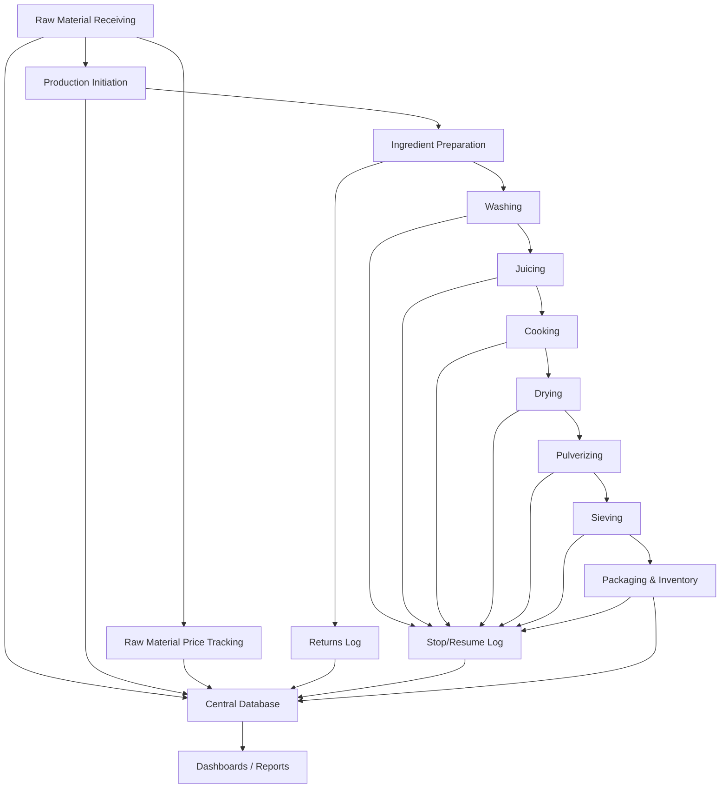
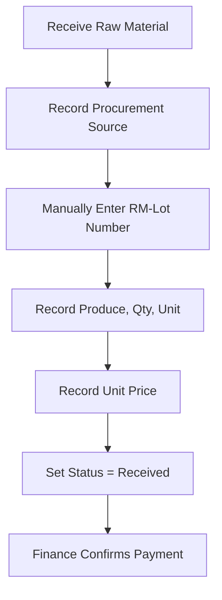
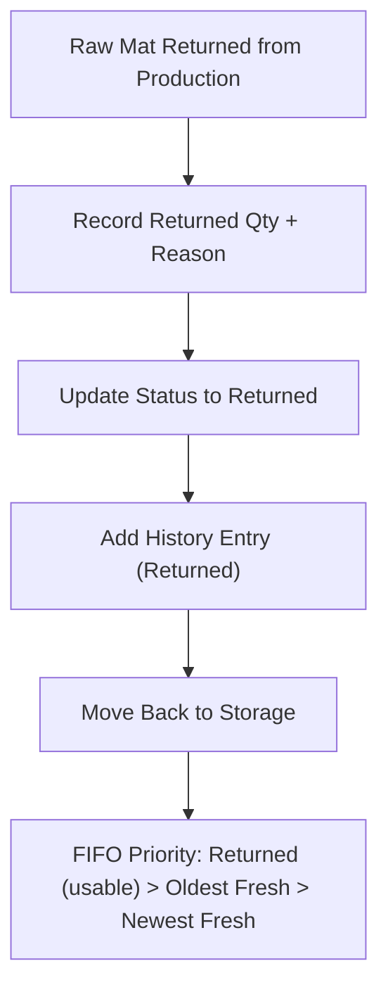
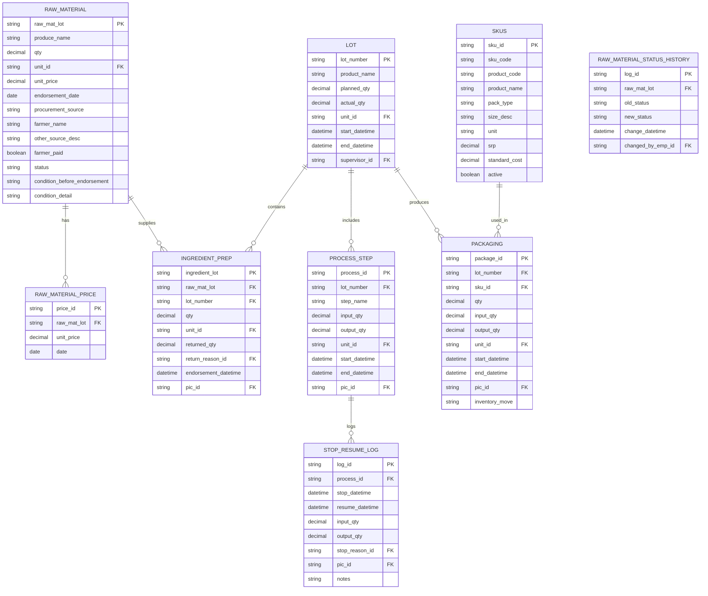

# Turmeric/Ginger Powder Production Tracking Specification

* * *

## 1\. Purpose

This specification defines a normalized data collection and monitoring system for the turmeric/ginger powder production process. It provides:  
• a normalized database schema for backend implementation, and  
• detailed *process‑level* data dictionaries and SKU references to be used by the spreadsheet/form/web‑form design team.

Refinements: manual lot number entry at the warehouse, status and quality flags for raw material, FIFO priority (returned first), separation of ingredient lots in washing/juicing and a unified product lot only after cooking, and new KPIs to monitor raw‑material utilisation, quality rejection rate, in‑production stock and return rate.

---

## 2\. Terms & Definitions

- **Lot Number** – Unique identifier for each production batch. Format: `YYYYMMDD‑SEQ‑PRODUCT`.  
- **Procurement Source** – Where the raw material was procured: `Farmer`, `Market`, or `Other`.  
- **SKU** – Stock Keeping Unit: unique identifier for a packaged finished good variant (product + pack + size + optional variant).  
- **Production Stop / Resume** – Step‑level stoppages recorded in a single `STOP_RESUME_LOG` table.  
- **PIC** – Person In Charge (employee reference ID + name).  
- **Unit** – Standard units (g, kg, ml, l). All quantity fields reference these via `UNITS`.  
- **Material Status** – Current state of a raw‑material lot: `Received`, `Issued`, `Returned`, `Disposed`.  
- **Condition Before Endorsement** – Quality assessment before the material is issued to production: `GOOD` or `NO GOOD`.  
- **Condition Detail** – Free‑text description of the condition when `NO GOOD`.

---

## 3\. High‑Level Process Workflow (reminder)

1.  Warehouse: Raw Material Receiving (manual lot entry, status & condition flags).  
2.  Raw Material Price Tracking.  
3.  Process‑0: Production Initiation.  
4.  Process‑1: Ingredient Preparation (FIFO, returned first, usability check).  
5.  Process‑2: Washing (per ingredient lot).  
6.  Process‑3: Juicing (per ingredient lot).  
7.  Process‑4: Cooking (combination step – unified product lot created).  
8.  Process‑5: Drying.  
9.  Process‑6: Pulverizing.  
10. Process‑7: Sieving.  
11. Process‑8: Packaging & Inventory.

**Workflow (Mermaid):**

---

## 4\. Lot Numbering Convention (unchanged)

- Format: `YYYYMMDD‑SEQ‑PRODUCT` (e.g. `20250911‑01‑TURM`).  
- Sequence restarts daily per product code.  
- Product codes used in this document: `TGLM` = Turmeric Ginger Lemongrass (powder), `TJD` = Turmeric Juice Drink, `TJWC` = Turmeric Juice with Calamansi, `GTSB` = Ginger Tea (Salabat), `TGLB` = Turmeric Ginger Lemongrass (Brew—tea bags), `TGPP` = Turmeric Ginger Pulp.

---

## 5\. Reference Tables (normalized)

- **UNITS** (`unit_id`, `unit_name`, `description`).  
- **EMPLOYEES** (`emp_id`, `name`, `role`, `status`).  
- **STOP_REASONS** (`reason_id`, `category`, `description`).  
- **RETURN_REASONS** (`reason_id`, `category`, `description`).  
- **SKUS** (SKU records — described in section 11).  
- **RAW_MATERIAL_STATUS_HISTORY** (`log_id PK`, `raw_mat_lot FK`, `old_status`, `new_status`, `change_datetime`, `changed_by_emp_id`).

---

## 6\. Process‑Level Data Dictionaries (For Forms & Sheets)

> Note: these are the fields your forms/spreadsheet designers should use. The backend uses the normalized schema (tables & keys) but these fields map to the DB columns.

### 6.1 Warehouse: Raw Material Receiving

| Field | Description | Type | Allowed Values | Unit | Recorded By | Timing |
|-------|-------------|------|----------------|------|--------------|--------|
| Serial Number | Unique raw material ID | String | Auto‑generated | N/A | Warehouse Staff | At receipt |
| Endorsement Date | Date endorsed | Date | ISO 8601 | N/A | Warehouse Staff | At receipt |
| Procurement Source | Procurement method | Enum | Farmer, Market, Other | N/A | Warehouse Staff | At receipt |
| Farmer Name | Name of farmer (if Farmer source) | String | Free text | N/A | Warehouse Staff | At receipt |
| Other Source Description | Free‑text if Market/Other | String | Free text | N/A | Warehouse Staff | At receipt |
| Farmer Paid | Status if paid | Boolean | Yes/No | N/A | Finance/Warehouse | At confirmation |
| Produce Name | Type of produce | Enum | Turmeric, Ginger | N/A | Warehouse Staff | At receipt |
| Qty | Quantity received | Decimal | ≥0 | See UNITS | Warehouse Staff | At receipt |
| Unit Price | Price per unit (currency) | Decimal | ≥0 | Currency | Warehouse Staff | At receipt |
| Raw Material Lot Number | Lot ID | String | Auto‑generated | N/A | Warehouse Staff | At receipt |
| **Status** | Current status of the lot | Enum | Received, Issued, Returned, Disposed | N/A | Warehouse Staff | At receipt & whenever status changes |
| **Condition Before Endorsement** | Quality assessment before issuance | Enum | GOOD, NO GOOD | N/A | Warehouse Staff | At receipt |
| **Condition Detail** | Description if NO GOOD | String | Free text | N/A | Warehouse Staff | If Condition = NO GOOD |
| **History** | Status change log (printed on form) | — | Date/Time, From → To, Person | N/A | Warehouse Staff | Whenever status changes |

**Workflow (Manual Receipt)**

---

#### 6.1.1 Handling Returned Raw Materials (Warehouse)

| Field | Description | Type | Allowed Values | Unit | Recorded By | Timing |
|-------|-------------|------|----------------|------|--------------|--------|
| Returned Qty | Quantity returned from production | Decimal | ≥0 | See UNITS | Warehouse Staff | At return |
| Return Reason | Category of return | Enum | Damaged, Excess, Wrong, Quality, Other | N/A | Warehouse Staff | At return |
| Flag Returned | Indicator that the lot is returned from production | Boolean | Yes/No | N/A | Warehouse Staff | At return |
| **Status** | Updated to Returned | Enum | Received, Issued, Returned, Disposed | N/A | Warehouse Staff | At return |
| **Condition Before Endorsement** | Quality before re‑issue | Enum | GOOD, NO GOOD | N/A | Warehouse Staff | At return |
| **Condition Detail** | Description if NO GOOD | String | Free text | N/A | Warehouse Staff | If Condition = NO GOOD |
| **History** | Status change log (printed on form) | — | Date/Time, From → To, Person | N/A | Warehouse Staff | Whenever status changes |

**Workflow (Returned Materials)**

---

### 6.2 Process‑0: Production Initiation

| Field | Description | Type | Allowed Values | Unit | Recorded By | Timing |
|-------|-------------|------|----------------|------|--------------|--------|
| Lot Number | Production batch ID | String | Format: `YYYYMMDD‑SEQ‑PRODUCT` | N/A | Supervisor | Start |
| Product Name | Product being produced | Enum | TURMERIC, GINGER | N/A | Supervisor | Start |
| Planned Qty | Target quantity | Decimal | >0 | See UNITS | Supervisor | Start |
| Actual Qty | Final achieved output | Decimal | ≥0 | See UNITS | Supervisor | End |
| Start Datetime | Production start | DateTime | ISO 8601 | N/A | Supervisor | Start |
| End Datetime | Production end | DateTime | ISO 8601 | N/A | Supervisor | End |

---

### 6.3 Process‑1: Ingredient Preparation

| Field | Description | Type | Allowed Values | Unit | Recorded By | Timing |
|-------|-------------|------|----------------|------|--------------|--------|
| Ingredient Lot Number | Ingredient prep lot | String | Auto‑generated | N/A | Operator | Start |
| Raw Material Lot Number | Reference to raw mat lot | String | Existing lot | N/A | Operator | Start |
| Qty | Issued quantity | Decimal | ≥0 | See UNITS | Operator | Issue |
| Returned Qty | Returned material | Decimal | ≥0 | See UNITS | Operator | Return |
| Return Reason | Reason category | Enum | Damaged, Excess, Wrong, Quality, Other | N/A | Operator | Return |
| PIC | Responsible person | String | EmpID+Name | N/A | Operator | Always |
| Endorsement Datetime | Material endorsed | DateTime | ISO 8601 | N/A | Operator | Issue |
| **Usable For Production** | Flag from RAW_MATERIAL (`usable_for_production`) | Boolean | Yes/No | N/A | Operator | Check before issuing |
| **Condition At Endorsement** | From RAW_MATERIAL (`condition_before_endorsement`) | Enum | GOOD, NO GOOD | N/A | Operator | Check before issuing |

---

### 6.4 Process‑2: Washing (Per Ingredient Lot)

> **Note:** This step operates on the individual ingredient lot, *not* a unified product lot.

| Field | Description | Type | Unit | Notes |
|-------|-------------|------|------|-------|
| Lot Number | Batch reference (unified product lot) | String | N/A | Required |
| Ingredient Lot Number | Source material (ingredient prep lot) | String | N/A | Link to prep |
| Input Qty | Material entering step | Decimal | See UNITS | Required |
| Output Qty | Material exiting step | Decimal | See UNITS | Required |
| Start Datetime | Start time | DateTime | N/A | Required |
| Stop Datetime | Stop time | DateTime | N/A | Optional (if stopped) |
| Resume Datetime | Resume time | DateTime | N/A | Optional |
| Stop Reason | Reason for stop | Enum | Machine, Material, Labor, Quality, Other | N/A |
| PIC | Responsible person | String | EmpID+Name | N/A |
| Loss Qty | (Calculated) Input – Output | Decimal | See UNITS | System‑calculated |

The same structure applies to **Juicing, Drying, Pulverizing and Sieving**.

---

### 6.5 Process‑4: Cooking (Combination Step)

> After cooking, a single unified product lot is created.

| Field | Description | Type | Unit |
|-------|-------------|------|------|
| Lot Number | Unified product lot | String | N/A |
| Ingredient Lot Numbers | Multiple ingredient prep lots | List of Strings | N/A |
| Input Qty per Ingredient Lot | Amount from each ingredient lot | Decimal | See UNITS |
| Output Qty | Combined output qty | Decimal | See UNITS |
| Start Datetime | Start time | DateTime | N/A |
| Stop Datetime | Stop time | DateTime | N/A |
| Resume Datetime | Resume time | DateTime | N/A |
| Stop Reason | Reason for stop | Enum | Machine, Material, Labor, Quality, Other |
| PIC | Responsible person | String | EmpID+Name |

---

### 6.6 Process‑8: Packaging & Inventory

| Field | Description | Type | Allowed Values | Unit | Recorded By |
|-------|-------------|------|----------------|------|--------------|
| Lot Number | Batch reference | String | Format: `YYYYMMDD‑SEQ‑PROD` | N/A | Operator |
| SKU_ID | Reference to SKU table | String | See SKUS | N/A | Operator |
| SKU_Code | Human‑readable SKU code | String | e.g. `TGLM-PCH-500G` | N/A | Operator |
| Qty | Units packaged (count) | Decimal | ≥0 | count | Operator |
| Input Qty | Material going into packaging | Decimal | ≥0 | See UNITS | Operator |
| Output Qty | Finished goods produced (net) | Decimal | ≥0 | See UNITS | Operator |
| Inventory Move | Movement | Enum | To Warehouse, To Dispatch | N/A | Operator |
| Start Datetime | Start time | DateTime | ISO 8601 | Operator |     |
| Stop Datetime | Stop time | DateTime | ISO 8601 | Operator |     |
| Resume Datetime | Resume time | DateTime | ISO 8601 | Operator |     |
| Stop Reason | Reason for stop | Enum | Machine, Material, Labor, Quality, Other | N/A | Operator |
| PIC | Responsible | String | EmpID+Name | Operator |     |

---

## 7\. Data Collection Workflow (unchanged)

1. Warehouse logs raw material receipt and price (`RAW_MATERIAL`, `RAW_MATERIAL_PRICE`).  
2. Supervisor defines Lot# and planned qty (`LOT`).  
3. Operators record ingredient preparation and returns (`INGREDIENT_PREP`).  
4. Each process step is recorded (`PROCESS_STEP`).  
5. Stop/resume events logged separately (`STOP_RESUME_LOG`).  
6. Packaging records SKU breakdown and inventory movements (`PACKAGING`).  
7. The system calculates yields, losses, downtime, and costs.  
8. Dashboard updates real‑time.  
9. Failsafe: GSheet or record book; later uploaded.

---

## 8\. KPI Data Dictionary (with formulas & source fields)

| KPI                             | Formula (source fields)                                                             | Unit      |
| ------------------------------- | ----------------------------------------------------------------------------------- | --------- |
| **Yield % per Step**            | `(Output ÷ Input) × 100`                                                            | %         |
| **Loss % per Step**             | `((Input – Output) ÷ Input) × 100`                                                  | %         |
| **Planned vs Actual Timeline**  | Supervisor Planned – (End − Start)                                                  | Hours     |
| **Downtime Frequency/Duration** | Count of stop events; Sum of `(Resume – Stop)`                                      | # / Hours |
| **Cost of Inputs**              | Σ(`RAW_MATERIAL.Qty × RAW_MATERIAL.Unit_Price`) for raw materials consumed by a lot | PHP       |
| **Cost of Outputs**             | Σ(`PACKAGING.Output_Qty × SKUS.SRP`) for the lot                                    | PHP       |
| **Raw Material Utilisation**    | `(Total Issued Qty ÷ Total Received Qty) × 100` (per product code)                  | %         |
| **Quality Rejection Rate**      | `(Qty of raw mats with condition = NO GOOD ÷ Total Received Qty) × 100`             | %         |
| **In‑Production Stock**         | Count of raw material lots with status = Issued                                     | Units     |
| **Return Rate**                 | `(Qty Returned ÷ Total Issued Qty) × 100`                                           | %         |

---

## 9\. Database Schema (updated ER diagram)

---

## 10\. Next Steps (recommended)

1. **Populate the new `RAW_MATERIAL_STATUS_HISTORY` table** with existing data if needed for historical audit.  
2. Update all warehouse and ingredient‑prep forms to include the new status, condition, and history fields.  
3. Train warehouse staff on manual lot‑number entry, status updates, FIFO priority and condition checks.  
4. Revise the packing and processing dashboards to include the new KPIs (utilisation, rejection rate, in‑production stock, return rate).  
5. Verify that the system’s workflow logic correctly enforces FIFO priority (returned first) and prevents issuance of non‑usable material.  
6. Conduct a pilot run to confirm that the printed forms capture all required data and that the database records reflect status changes accurately.

---