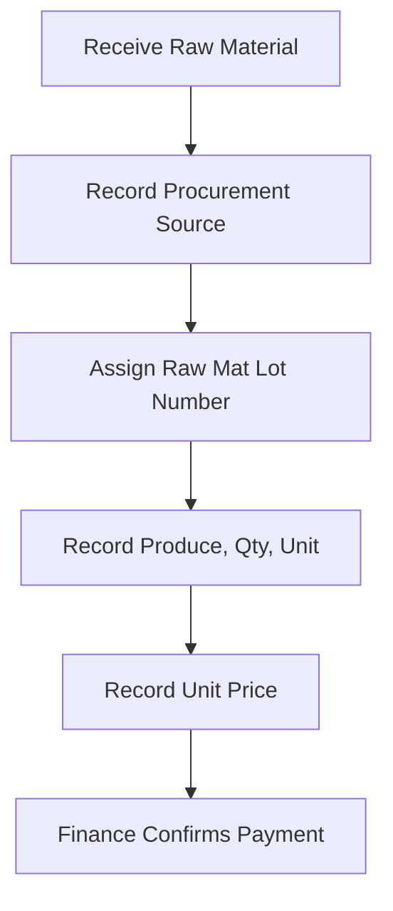
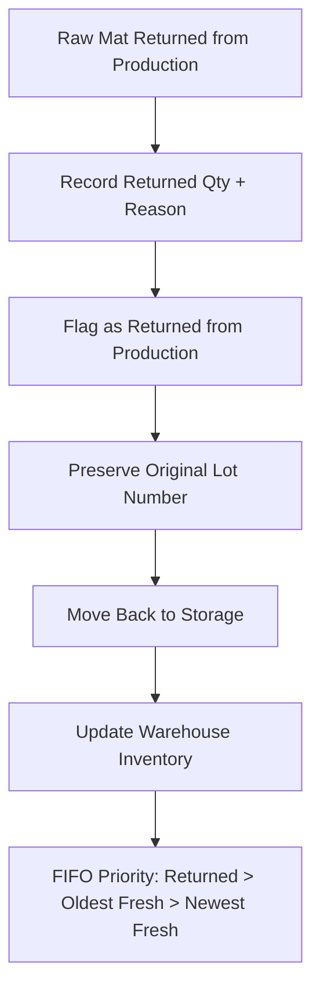
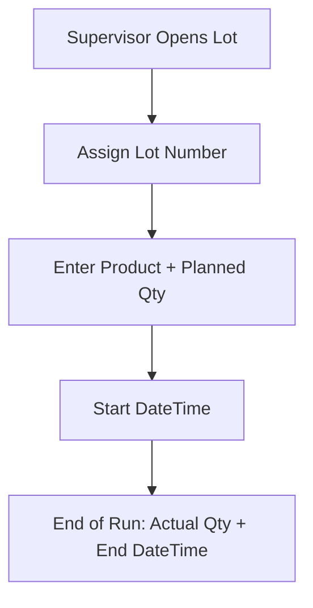
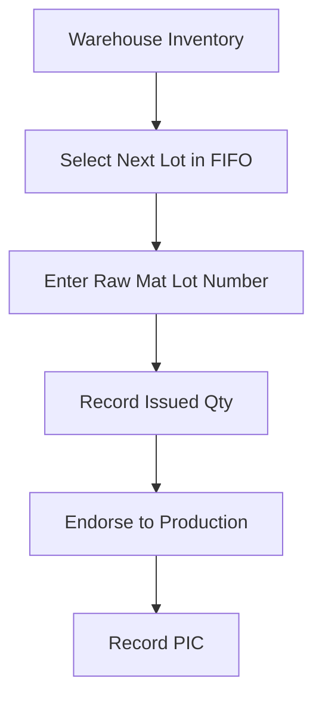
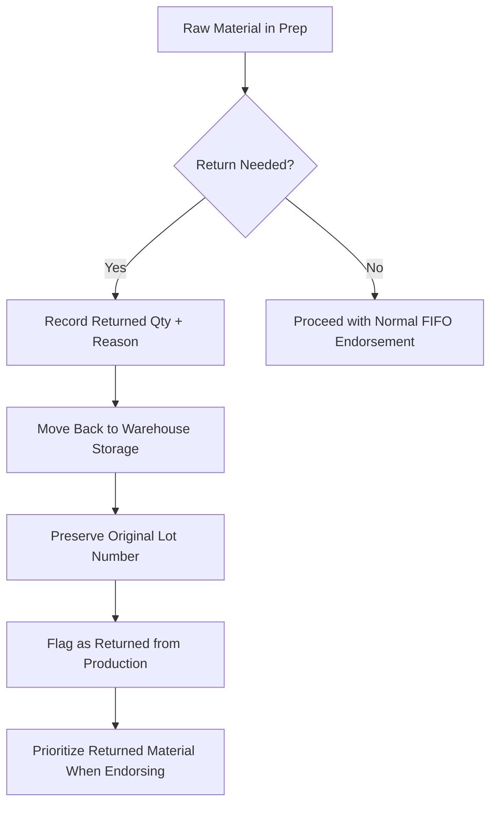
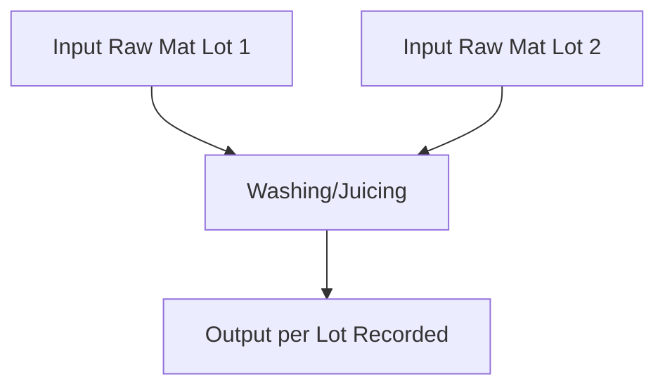
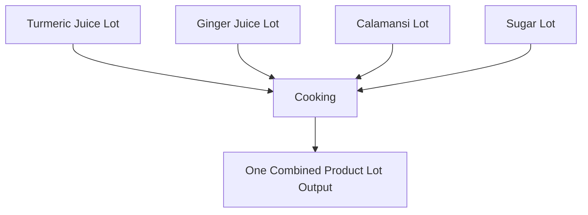
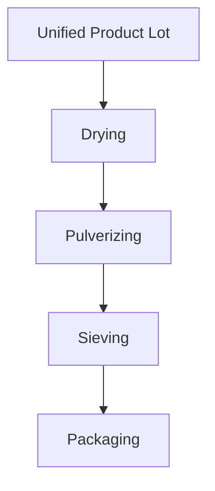
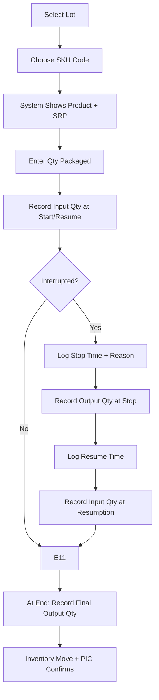
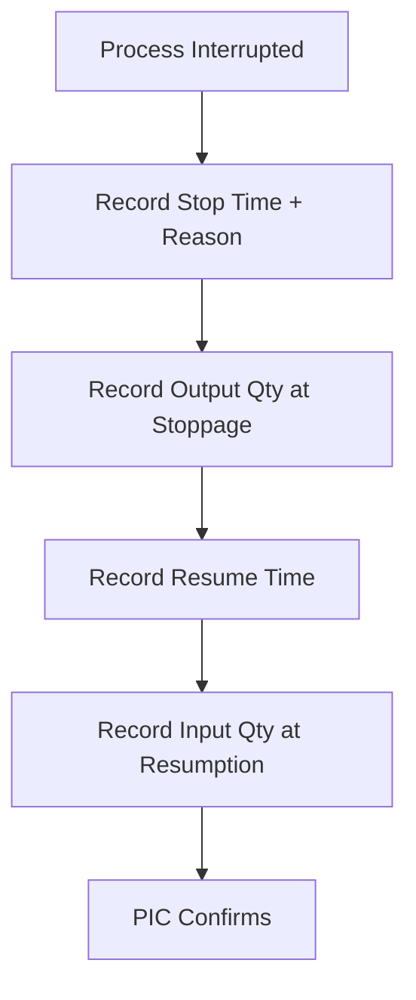

# IIDA Farms – Standard Operating Procedure (SOP) for Turmeric/Ginger Powder Production & Data Recording

* * *

## 1\. Purpose

This SOP provides step-by-step instructions for warehouse staff, operators, and supervisors to ensure consistent production and accurate data recording across all stages of turmeric/ginger powder production. It is designed to complement the technical specification and support real-time monitoring, traceability, and KPI reporting.

* * *

## 2\. Scope

This SOP applies to all staff handling raw material receiving, production processes, packaging, inventory movements, and data recording in the IIDA Farms turmeric/ginger powder value chain.

* * *

## 3\. Roles & Responsibilities

- **Warehouse Staff:** Receive and record raw materials, procurement source, quantities, and prices. Manage returned raw materials separately from fresh receipts.
- **Finance:** Confirm payments, verify unit prices.
- **Supervisors:** Define production lots, planned vs actual, monitor timelines, sign off.
- **Operators:** Execute and record all process steps, including stoppages, inputs/outputs, and packaging.
- **QC Staff:** Validate yields, losses, packaging accuracy.

* * *

## 4\. Procedures

### 4.1 Raw Material Receiving (Warehouse)

1.  Record **Procurement Source**: Farmer, Market, Other.
    
    - If Farmer → record Farmer Name + Payment status.
    - If Market/Other → record description.
2.  Generate **Raw Material Lot Number** (auto by system).
    
3.  Record **Produce Name** (Turmeric/Ginger).
    
4.  Enter **Quantity** and **Unit** (g, kg, ml, l).
    
5.  Enter **Unit Price** (currency).
    
6.  Finance updates **Farmer Paid** status.
    

**Mermaid Workflow (Fresh Receipt):**

* * *

### 4.1.1 Handling Returned Raw Materials (Warehouse)

Returned materials from the production area must be clearly identified and separated from freshly received warehouse stock.

1.  When raw material is returned from **Ingredient Preparation** or other production processes:
    
    - Record **Returned Qty**.
    - Record **Return Reason** (Damaged, Excess, Wrong, Quality, Other).
    - Identify as **Returned from Production** (flag in system).
    - Preserve **original Raw Material Lot Number** (no new lot created).
2.  Move the returned material back to warehouse storage.
    
3.  Warehouse inventory must track separately:
    
    - **Fresh Receipts** (never issued to production).
    - **Returned from Production** (previously issued, now returned).
4.  When issuing raw mats for production, system enforces **FIFO priority**:
    
    - Returned items first.
    - Then oldest fresh receipts.
    - Finally newest fresh receipts.

**Mermaid Workflow (Returned Materials):**

* * *

### 4.2 Production Initiation (Supervisor)

1.  Assign **Lot Number** (`YYYYMMDD-SEQ-PRODUCT`).
2.  Enter **Product Name** and **Planned Quantity**.
3.  Record **Start DateTime**.
4.  At end, record **Actual Quantity** and **End DateTime**.

**Mermaid Workflow:**

* * *

### 4.3 Ingredient Preparation (Operator)

Ingredient preparation ensures raw materials are issued to production in FIFO (First-In, First-Out) order to maintain quality. Returned raw materials are prioritized first before issuing new materials.

#### Normal Flow (Issuing to Production)

1.  Pull raw material from warehouse, following **FIFO order**.
2.  Enter **Raw Material Lot Number** (no new lot is generated).
3.  Record **Issued Qty + Unit**.
4.  Endorse directly to production with existing lot number.
5.  Always record **PIC**.

**Mermaid Workflow (Normal):**

#### Flow with Returned Material

1.  If material is returned during preparation:
    
    - Record **Returned Qty + Reason**.
    - Move the returned raw material back to **warehouse storage**.
    - Maintain its **original Raw Material Lot Number**.
2.  When endorsing to production:
    
    - Prioritize using **returned materials first**.
    - After returns are consumed, continue with FIFO order for remaining lots.

**Mermaid Workflow (Return Case):**

* * *

### 4.4 Processing Steps (Multi-Ingredient Handling)

From Washing to Cooking, ingredients may be handled separately and then combined. After Cooking, all processes operate on a **single unified product lot**.

#### 4.4.1 Washing & Juicing (Per Ingredient Lot)

1.  At **start or resumption**, record **Input Qty per Raw Material Lot**.
    
2.  Record **Start DateTime**.
    
3.  If stoppage occurs:
    
    - Record **Stop DateTime** and **Reason**.
    - Record **Output Qty per Raw Material Lot** at stoppage.
    - Record **Resume DateTime**.
    - Record **new Input Qty** at resumption.
4.  At the **end of step**, record **final Output Qty per Raw Material Lot**.
    

**Mermaid Workflow (Washing/Juicing):**

#### 4.4.2 Cooking (Combination Step)

1.  Gather multiple ingredient lots (e.g., turmeric juice, ginger juice, calamansi, sugar).
    
2.  At **start or resumption**, record **Input Qty per Ingredient Lot**.
    
3.  Record **Start DateTime**.
    
4.  If stoppage occurs:
    
    - Record **Stop Datetime + Reason**.
    - Record **Partial Output Qty** at stoppage.
    - Record **Resume Datetime**.
    - Record **Input Qty per Ingredient Lot** at resumption.
5.  At **end of Cooking**, record **one combined Product Lot Number** with **Output Qty**.
    

**Mermaid Workflow (Cooking Combination):**

#### 4.4.3 Post-Cooking (Drying → Sieving)

1.  Processes now handle **only one unified product lot**.
2.  At **start or resumption**, record **Input Qty**.
3.  If stoppage occurs: record **Stop Time, Reason, Output Qty**.
4.  At **resumption**, record **Input Qty**.
5.  At **end**, record **Output Qty**.

**Mermaid Workflow (Unified Lot Handling):**

* * *

### 4.5 Packaging & Inventory (Operator)

1.  Select **Lot Number**.
2.  Choose **SKU Code** (dropdown). Example: `TGLM-PCH-500G`.
3.  Confirm product and SRP shown on form.
4.  Enter **Qty Packaged (units)**.
5.  At **start or resumption**, record **Input Qty**.
6.  At **end or stoppage**, record **Output Qty**.
7.  Record **Inventory Move** (To Warehouse, To Dispatch).
8.  Record **Start/Stop/Resume** if interrupted.
9.  Confirm **PIC**.

**Mermaid Workflow:**

* * *

### 4.6 Stoppage & Resumption (All steps)

- At stoppage:
    
    - Record Stop Datetime
    - Record Stop Reason
    - Record **Output Qty at stoppage**
- At resumption:
    
    - Record Resume Datetime
    - Record **Input Qty at resumption**
    - PIC confirms

**Mermaid Workflow:**

* * *

### 4.7 KPI Recording

Staff entries drive system KPIs:

- **Yield % per Step:** `(Output ÷ Input) × 100`.
- **Loss % per Step:** `((Input – Output) ÷ Input) × 100`.
- **Planned vs Actual Timeline:** Supervisor’s planned vs actual times.
- **Downtime Frequency/Duration:** Derived from Stop/Resume logs.
- **Cost of Inputs:** Σ(`Raw Material Qty × Price`).
- **Cost of Outputs:** Σ(`Output Qty × SKU SRP`).

* * *

## 5\. Data Recording Rules

- Always record **Input Qty** at start or resumption.
- Always record **Output Qty** at stoppage and end of process.
- Record **in real time** whenever possible.
- If offline → use GSheet or logbook, update within 24h.
- Use only standard **units** (g, kg, ml, l).
- Use only official **SKU Codes**.
- Supervisors review & sign off daily.

* * *

## 6\. SKU Master List (Reference for Operators)

| SKU Code | Product | Size | SRP |
| --- | --- | --- | --- |
| TGLM-PCH-500G | Turmeric Ginger Lemongrass | 500g | P220 |
| TGLM-PCH-200G | Turmeric Ginger Lemongrass | 200g | P130 |
| TGLM-SAC-10GX12 | Turmeric Ginger Lemongrass | 10g×12 sachets | P115 |
| TJD-PCH-500G | Turmeric Juice Drink | 500g | P220 |
| TJD-PCH-200G | Turmeric Juice Drink | 200g | P130 |
| TJD-SAC-10GX12 | Turmeric Juice Drink | 10g×12 sachets | P115 |
| TJWC-PCH-500G | Turmeric Juice with Calamansi | 500g | P220 |
| TJWC-PCH-200G | Turmeric Juice with Calamansi | 200g | P130 |
| GTSB-PCH-500G | Ginger Tea (Salabat) | 500g | P220 |
| GTSB-PCH-200G | Ginger Tea (Salabat) | 200g | P130 |
| GTSB-SAC-10GX12 | Ginger Tea (Salabat) | 10g×12 sachets | P115 |
| TGLB-TBG-3.5GX10 | Turmeric Ginger Lemongrass Brew | 3.5g×10 | P130 |
| TGLB-CIN-TBG-3.5GX10 | TGLM Brew w/ Cinnamon | 3.5g×10 | P150 |
| TGPP-PCH-50G | Turmeric Ginger Pulp | 50g | P95 |

* * *

## 7\. Compliance & Audit

- All data entries are part of full production traceability.
- Missing or late entries will trigger dashboard alerts.
- Supervisors must audit records weekly for accuracy and completeness.

* * *