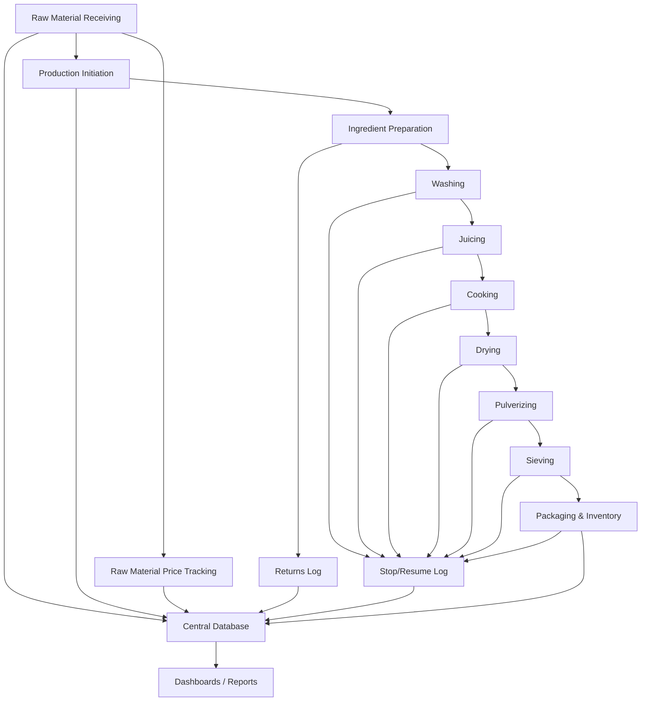
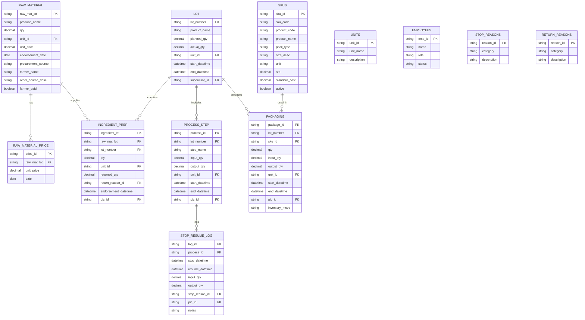

# Turmeric/Ginger Powder Production Tracking Specification

* * *

## 1\. Purpose

This specification defines a normalized data collection and monitoring system for the turmeric/ginger powder production process. It provides:  
• a normalized database schema for backend implementation, and  
• detailed *process-level* data dictionaries and SKU references to be used by the spreadsheet/form/web-form design team.

Refinements: separation of procurement sources in warehouse receiving, centralized stop/resume logging, and a documented SKU convention (based on the supplied product flyer image).

* * *

## 2\. Terms & Definitions

- **Lot Number** – Unique identifier for each production batch. Format: `YYYYMMDD-SEQ-PRODUCT`.
- **Procurement Source** – Where the raw material was procured: `Farmer`, `Market`, or `Other`.
- **SKU** – Stock Keeping Unit: unique identifier for a packaged finished good variant (product + pack + size + optional variant).
- **Production Stop / Resume** – Step-level stoppages recorded in a single STOP_RESUME_LOG table.
- **PIC** – Person In Charge (employee reference ID + name).
- **Unit** – Standard units (g, kg, ml, l). All quantity fields reference these via UNITS.

* * *

## 3\. High-Level Process Workflow (reminder)

1.  Warehouse: Raw Material Receiving (track procurement source)
2.  Raw Material Price Tracking
3.  Process-0: Production Initiation
4.  Process-1: Ingredient Preparation
5.  Process-2: Washing
6.  Process-3: Juicing
7.  Process-4: Cooking
8.  Process-5: Drying
9.  Process-6: Pulverizing
10. Process-7: Sieving
11. Process-8: Packaging & Inventory

**Workflow (Mermaid):**

* * *

## 4\. Lot Numbering Convention (unchanged)

- Format: `YYYYMMDD-SEQ-PRODUCT` (e.g. `20250911-01-TURM`).
- Sequence restarts daily per product.
- Product codes used in this document: `TGLM` = Turmeric Ginger Lemongrass (powder), `TJD` = Turmeric Juice Drink, `TJWC` = Turmeric Juice with Calamansi, `GTSB` = Ginger Tea (Salabat), `TGLB` = Turmeric Ginger Lemongrass (Brew—tea bags), `TGPP` = Turmeric Ginger Pulp.

* * *

## 5\. Reference Tables (normalized)

- **UNITS** (g, kg, ml, l)
- **EMPLOYEES** (Emp_ID, Name, Role, Status)
- **STOP_REASONS** (Reason_ID, Category, Description)
- **RETURN_REASONS** (Reason_ID, Category, Description)
- **SKUS** (SKU records — described in section 11)

* * *

## 6\. Process-Level Data Dictionaries (For Forms & Sheets)

> Note: these are the fields your forms/spreadsheet designers should use. The backend uses the normalized schema (tables & keys) but these fields map to the DB columns.

### Warehouse: Raw Material Receiving

| Field | Description | Type | Allowed Values | Unit | Recorded By | Timing |
| --- | --- | --- | --- | --- | --- | --- |
| Serial Number | Unique raw material ID | String | Auto-generated | N/A | Warehouse Staff | At receipt |
| Endorsement Date | Date endorsed | Date | ISO 8601 | N/A | Warehouse Staff | At receipt |
| Procurement Source | Procurement method | Enum | Farmer, Market, Other | N/A | Warehouse Staff | At receipt |
| Farmer Name | Name of farmer (if Farmer source) | String | Free text | N/A | Warehouse Staff | At receipt |
| Other Source Description | Free-text if Market/Other | String | Free text | N/A | Warehouse Staff | At receipt |
| Farmer Paid | Status if paid | Boolean | Yes/No | N/A | Finance/Warehouse | At confirmation |
| Produce Name | Type of produce | Enum | Turmeric, Ginger | N/A | Warehouse Staff | At receipt |
| Qty | Quantity received | Decimal | ≥0  | See UNITS | Warehouse Staff | At receipt |
| Unit Price | Price per unit (currency) | Decimal | ≥0  | Currency | Warehouse Staff | At receipt |
| Raw Material Lot Number | Lot ID | String | Auto-generated | N/A | Warehouse Staff | At receipt |

### Raw Material Price Tracking

| Field | Description | Type | Unit | Recorded By | Timing |     |
| --- | --- | --- | --- | --- | --- | --- |
| Raw Material Name | Produce name | Enum | Turmeric, Ginger | N/A | Warehouse/Finance | At receipt |
| Raw Mat Lot Number | Link to raw material | String |     | Warehouse/Finance | At receipt |     |
| Unit Price | Price per unit | Decimal | Currency | Warehouse/Finance | At receipt |     |
| Date | Pricing date | Date | ISO 8601 | Warehouse/Finance | At receipt |     |

### Process-0: Production Initiation

| Field | Description | Type | Allowed Values | Unit | Recorded By | Timing |
| --- | --- | --- | --- | --- | --- | --- |
| Lot Number | Production batch ID | String | Format: `YYYYMMDD-SEQ-PRODUCT` | N/A | Supervisor | Start |
| Product Name | Product being produced | Enum | TURMERIC, GINGER | N/A | Supervisor | Start |
| Planned Qty | Target quantity | Decimal | \>0 | See UNITS | Supervisor | Start |
| Actual Qty | Final achieved output | Decimal | ≥0  | See UNITS | Supervisor | End |
| Start Datetime | Production start | DateTime | ISO 8601 | N/A | Supervisor | Start |
| End Datetime | Production end | DateTime | ISO 8601 | N/A | Supervisor | End |

### Process-1: Ingredient Preparation

| Field | Description | Type | Allowed Values | Unit | Recorded By | Timing |
| --- | --- | --- | --- | --- | --- | --- |
| Ingredient Lot Number | Ingredient prep lot | String | Auto-generated | N/A | Operator | Start |
| Raw Material Lot Number | Reference to raw mat lot | String | Existing lot | N/A | Operator | Start |
| Qty | Issued quantity | Decimal | ≥0  | See UNITS | Operator | Issue |
| Returned Qty | Returned material | Decimal | ≥0  | See UNITS | Operator | Return |
| Return Reason | Reason category | Enum | Damaged, Excess, Wrong, Quality, Other | N/A | Operator | Return |
| PIC | Responsible person | String | EmpID+Name | N/A | Operator | Always |
| Endorsement Datetime | Material endorsed | DateTime | ISO 8601 | N/A | Operator | Issue |

### Process-2: Washing (and Processes 3–7: Juicing, Cooking, Drying, Pulverizing, Sieving)

> Forms for processes 2–7 should use the same structure (one form per step) to make UI consistent.

| Field | Description | Type | Unit | Notes |     |
| --- | --- | --- | --- | --- | --- |
| Lot Number | Batch reference | String | N/A | Required |     |
| Ingredient Lot Number | Source material | String | N/A | Link to prep |     |
| Input Qty | Material entering step | Decimal | See UNITS | Required |     |
| Output Qty | Material exiting step | Decimal | See UNITS | Required |     |
| Start Datetime | Start time | DateTime | N/A | Required |     |
| Stop Datetime | Stop time | DateTime | N/A | Optional (if stopped) |     |
| Resume Datetime | Resume time | DateTime | N/A | Optional |     |
| Stop Reason | Reason for stop | Enum | Machine, Material, Labor, Quality, Other | N/A | Optional |
| PIC | Responsible person | String | EmpID+Name | N/A | Required |
| Loss Qty | (Calculated) Input – Output | Decimal | See UNITS | System-calculated |     |

### Process-8: Packaging & Inventory

| Field | Description | Type | Allowed Values | Unit | Recorded By |
| --- | --- | --- | --- | --- | --- |
| Lot Number | Batch reference | String | Format: `YYYYMMDD-SEQ-PROD` | N/A | Operator |
| SKU_ID | Reference to SKU table | String | See SKUS | N/A | Operator |
| SKU_Code | Human-readable SKU code | String | e.g. TGLM-PCH-500G | N/A | Operator |
| Qty | Units packaged (count) | Decimal | ≥0  | count | Operator |
| Input Qty | Material going into packaging | Decimal | ≥0  | See UNITS | Operator |
| Output Qty | Finished goods produced (net) | Decimal | ≥0  | See UNITS | Operator |
| Inventory Move | Movement | Enum | To Warehouse, To Dispatch | N/A | Operator |
| Start Datetime | Start time | DateTime | ISO 8601 | Operator |     |
| Stop Datetime | Stop time | DateTime | ISO 8601 | Operator |     |
| Resume Datetime | Resume time | DateTime | ISO 8601 | Operator |     |
| Stop Reason | Reason for stop | Enum | Machine, Material, Labor, Quality, Other | N/A | Operator |
| PIC | Responsible | String | EmpID+Name | Operator |     |

* * *

## 7\. Data Collection Workflow (unchanged)

1.  Warehouse logs raw material receipt and price (RAW_MATERIAL, RAW_MATERIAL_PRICE).
2.  Supervisor defines Lot# and planned qty (LOT).
3.  Operators record ingredient preparation and returns (INGREDIENT_PREP).
4.  Each process step is recorded (PROCESS_STEP).
5.  Stop/resume events logged separately (STOP_RESUME_LOG).
6.  Packaging records SKU breakdown and inventory movements (PACKAGING).
7.  System calculates yields, losses, downtime, and costs.
8.  Dashboard updates real-time.
9.  Failsafe: GSheet or record book; later uploaded.

* * *

## 8\. KPI Data Dictionary (with formulas & source fields)

(see previous KPIs; cost KPIs expanded below)

### Cost of Input Raw Materials (new detail)

- **Definition:** Total procurement cost of raw materials consumed by a lot/period.
- **Formula:** Σ(`RAW_MATERIAL.Qty` × `RAW_MATERIAL.Unit_Price`) for raw materials *consumed* by a given LOT / period.
- **Source Fields:** `RAW_MATERIAL.Qty`, `RAW_MATERIAL.Unit_Price`, mapping of `RAW_MATERIAL` → `INGREDIENT_PREP` → `LOT`.
- **Unit:** Currency (PHP)
- **Responsible Role:** Finance

### Cost of Output Products (new detail)

- **Definition:** Valuation of finished goods produced (using a standard product price or manufacturing cost).
- **Formula (retail SRP basis):** Σ(`PACKAGING.Output_Qty` × `SKUS.SRP`)
- **Formula (manufacturing cost basis):** Σ(material costs allocated to lot) ÷ produced output units (g or count) then × `PACKAGING.Output_Qty`.
- **Source Fields:** `PACKAGING.Output_Qty`, `SKUS.SRP`, `RAW_MATERIAL` cost mapping.
- **Unit:** Currency (PHP)
- **Responsible Role:** Finance

* * *

## 9\. SKU Convention & SKU Reference (parsed from supplied flyer)

**Objective:** create short, human-readable, unique SKU codes that capture product, pack type, and size — easy to use on forms and stable for reports.

**SKU format (recommended):**  
`<PRODUCT_CODE>-<PACK_TYPE>-<SIZE_DESC>[-<VARIANT>]`  
Where:  
• `PRODUCT_CODE` = 3–5 uppercase letters (documented below).  
• `PACK_TYPE` = `PCH` (pouch), `SAC` (sachet pack), `TBG` (tea-bag pack), `PUL` (pulp).  
• `SIZE_DESC` = `500G`, `200G`, `10GX12`, `3.5GX10`, `50G`, etc.  
• `VARIANT` = optional short code (e.g., `CIN` for cinnamon).

**SKU rules & best practices:**

- Max 30 characters. Use hyphens to separate elements.
- SKU is immutable once created. If the product package changes materially, create a new SKU.
- Maintain a `SKUS` master table with `SKU_ID`, `SKU_CODE`, `PRODUCT_NAME`, `PACK_TYPE`, `SIZE_DESC`, `UNIT`, `SRP`, `STANDARD_COST` (if applicable), and `ACTIVE` flag.

### Product codes (this spec)

| Product Name | Product Code |
| --- | --- |
| Turmeric Ginger Lemongrass (powder) | TGLM |
| Turmeric Juice Drink | TJD |
| Turmeric Juice with Calamansi | TJWC |
| Ginger Tea (Salabat) | GTSB |
| Turmeric Ginger Lemongrass (Brew - tea bags) | TGLB |
| Turmeric Ginger Pulp | TGPP |

### SKU Reference (extracted from flyer)

| SKU Code | Product Name | Pack Type | Size Desc | Unit Price (from flyer) | SRP (from flyer) | Notes |
| --- | --- | --- | ---: | ---: | ---: | --- |
| TGLM-PCH-500G | Turmeric Ginger Lemongrass | PCH | 500G | P200.00 | P220.00 | Pouch |
| TGLM-PCH-200G | Turmeric Ginger Lemongrass | PCH | 200G | P100.00 | P130.00 | Pouch |
| TGLM-SAC-10GX12 | Turmeric Ginger Lemongrass | SAC | 10G x12 | P85.00 | P115.00 | Sachet pack |
| TJD-PCH-500G | Turmeric Juice Drink | PCH | 500G | P200.00 | P220.00 | Pouch |
| TJD-PCH-200G | Turmeric Juice Drink | PCH | 200G | P100.00 | P130.00 | Pouch |
| TJD-SAC-10GX12 | Turmeric Juice Drink | SAC | 10G x12 | P85.00 | P115.00 | Sachet pack |
| TJWC-PCH-500G | Turmeric Juice with Calamansi | PCH | 500G | P200.00 | P220.00 | Pouch |
| TJWC-PCH-200G | Turmeric Juice with Calamansi | PCH | 200G | P100.00 | P130.00 | Pouch |
| GTSB-PCH-500G | Ginger Tea (Salabat) | PCH | 500G | P200.00 | P220.00 | Pouch |
| GTSB-PCH-200G | Ginger Tea (Salabat) | PCH | 200G | P100.00 | P130.00 | Pouch |
| GTSB-SAC-10GX12 | Ginger Tea (Salabat) | SAC | 10G x12 | P85.00 | P115.00 | Sachet pack |
| TGLB-TBG-3.5GX10 | Turmeric Ginger Lemongrass (Brew) | TBG | 3.5G x10 | P100.00 | P130.00 | Tea bags |
| TGLB-CIN-TBG-3.5GX10 | Turmeric Ginger Lemongrass (brew) with Cinnamon | TBG | 3.5G x10 | P120.00 | P150.00 | Tea bags, cinnamon variant |
| TGPP-PCH-50G | Turmeric Ginger Pulp | PCH | 50G | P65.00 | P95.00 | Pouch (pulp) |

> **Note:** Prices above were transcribed from the supplied product flyer image. Keep the `SKUS` master table authoritative: if future price updates are required, update the `SKUS` table `SRP`/`STANDARD_COST` and record historical changes in a separate `SKU_PRICE_HISTORY` table.

* * *

## 10\. Mapping SKUs into Packaging & DB schema

- `PACKAGING` records should reference `SKUS.SKU_ID` (or `SKU_CODE`) instead of a free-text SKU field.
- On the packaging/web-form, designers should show `SKU_Code` (e.g., `TGLM-PCH-500G`) and the `Product Name` and `SRP` for operator clarity.

**Updated PACKAGING form fields to include SKU:**

| Field | Notes |
| --- | --- |
| SKU_ID / SKU_Code | Foreign key → SKUS table. Show product & SRP to operator. |
| Qty (count) | Number of units packaged |
| Input Qty (kg/g) | Raw/processed material used in packaging |
| Output Qty (kg/g) | Finished goods weight produced |

* * *

## 11\. Database Schema (updated Mermaid ER diagram)

* * *

## 12\. Next steps (recommended)

1.  Confirm the SKU codes above; if you prefer different product abbreviations, share a mapping and I will update the SKUS table.
2.  Provide the canonical `Standard Product Price` (if different from flyer SRP) to be loaded into `SKUS.standard_cost` / `SKU_PRICE_HISTORY`.
3.  Ask front-end designers to use the process-level data dictionary tables as direct column/field references when building forms.
4.  If helpful, I can also produce sample spreadsheet column templates (CSV) and sample web form mockups (Mermaid UI sketch) for each process step and the packaging form.

* * *

*End of document.*